# 2_1_深度学习简介

**作者**: ZhouLong 
**创建日期**: 2026 年 02 月 02 日 
**版本**: 1.0 

    <a href="../01_Python介绍/1_12_常见库介绍.html" style="text-decoration: none; color: #0366d6; padding: 8px 15px; border: 1px solid #e1e4e8; border-radius: 5px;">👈 上一页</a>
    <a href="../index.html" style="text-decoration: none; color: #0366d6; padding: 8px 15px; border: 1px solid #e1e4e8; border-radius: 5px;">🏠 首页</a>
    <a href="./2_2_数据集.html" style="text-decoration: none; color: #0366d6; padding: 8px 15px; border: 1px solid #e1e4e8; border-radius: 5px;">下一页 👉</a>

## 1 什么是深度学习

<b>建议</b>

本文档撰写时很多内容参考《动手学深度学习》该书的结构和内容，但为了方便入门理解，做了简化处理。想深入学习，此书有纸质版和<a href="https://zh.d2l.ai/" target="_blank" >电子版（免费!）</a>，读者可根据阅读习惯来选择

    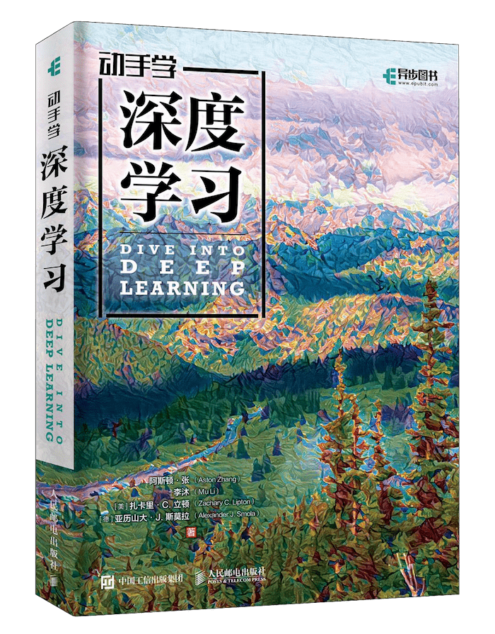

### 1.1 人工智能、机器学习与深度学习的关系

**人工智能（Artificial Intelligence, AI）** 是最广泛的概念，指让机器展现出类似人类智能行为的科学与工程。AI的目标是创建能够感知、推理、学习和解决问题的系统。它是一个宏大的研究领域，包含机器学习，深度学习，强化学习等多个分支。

**机器学习（Machine Learning, ML）** 是实现人工智能的一种核心方法。它不依赖于硬编码的规则，而是让计算机从数据中自动学习规律和模式，并对新的数据做出预测或决策。其核心是“从经验中学习”。传统的机器学习方法包括线性回归、决策树、支持向量机（SVM）等。

**深度学习（Deep Learning, DL）** 是机器学习的一个特定且强大的子领域。它主要基于**神经网络**，尤其是具有多个“深度”层的神经网络。深度学习通过多层次的非线性变换，从原始数据中自动提取由低级到高级的、越来越抽象的特征表示。

### 1.2 神经网络的基本思想

神经网络的基本思想受到**人脑神经元结构和功能的启发**。其核心概念如下：

### 1.3 **神经网络基本组成**

人工神经网络(Artificial Neural Networks，简写为ANNs)是一种模仿动物神经网络行为特征，进行分布式并行信息处理的数学模型。这种网络依靠系统的复杂程度，通过调整内部大量节点之间相互连接的关系，从而达到处理信息的目的，并具有自学习和自适应的能力。神经网络类型众多，其中最为重要的是多层感知机（Multi Layer Perceptron，MLP）。为了详细地描述神经网络，我们先从最简单的神经网络说起。

#### **感知机（Perceptron）**

感知机（Perceptron）于1957年由罗森布拉特（Rosenblatt）提出，是最早期的神经网络模型之一。其设计灵感来源于生物学中的神经元工作原理，核心思想是对生物神经网络的简化模拟。

人脑可以视为一个复杂的生物神经网络，其基本单元是神经元（neuron）。大量神经元相互连接，构成了一个能够处理信息的网络结构。在机器学习和深度学习领域，我们所讨论的“神经网络”（Neural Networks）通常指的是人工神经网络（Artificial Neural Networks, ANNs），即对人脑神经结构的计算抽象。

下图展示了生物神经元的基本工作机制：
神经元通过树突（dendrite）接收外部信号，并将这些电信号传递至细胞内部的细胞核（nucleus）。细胞核会对所有输入信号进行整合处理。当信号强度累积达到某个阈值时，神经元会被激活，并通过轴突（axon）输出一个新的电信号，从而传递给其他神经元或最终形成我们感知到的信息。其中，一个非常重要的特点就是，若某个神经元接收的信号强度累积没达到阈值，则该神经元不会传递新的电信号。这表现为信号传播到这就中断了。

感知机正是借鉴了这一生物过程，构建出一个简单的计算单元：它接收多个输入信号，进行加权求和，再通过一个阈值函数（激活函数）决定是否激活输出。这一机制奠定了现代神经网络的基础。

    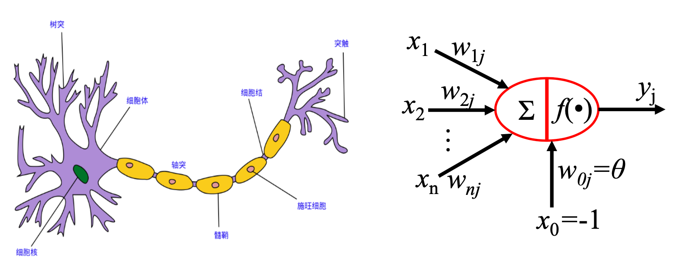

简单的感知机如下图：

    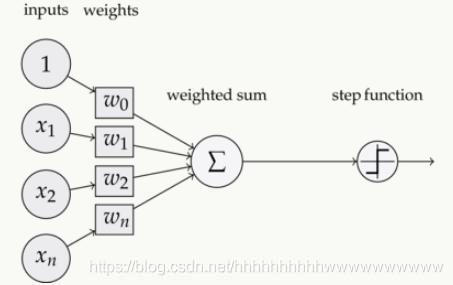

在数学实现上，我们可以这样理解：

    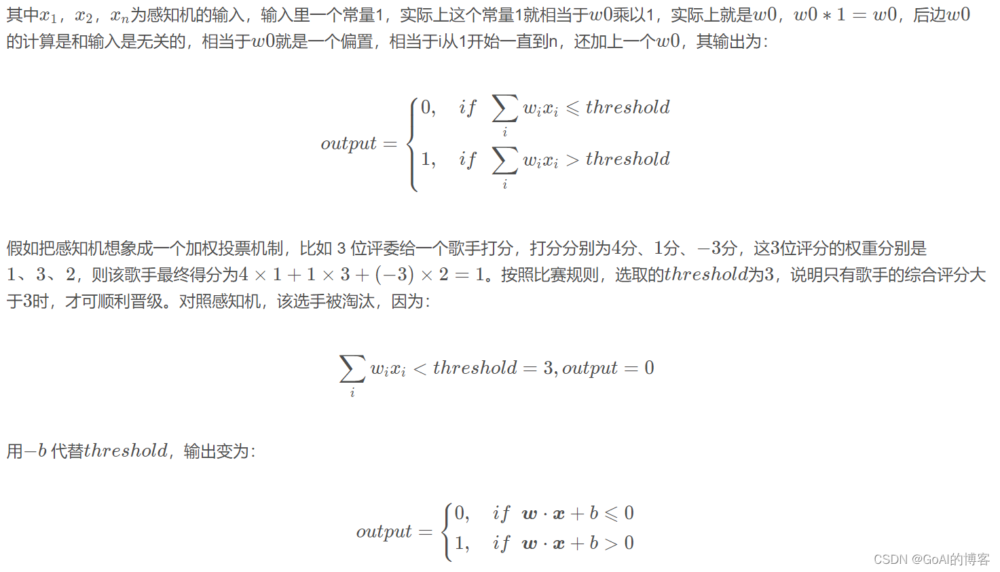

一个抽象的感知机单元与非门表示如下。当输入为x1=1，x2=2时，感知机输出为1x(-2)+2x(-2)+3=-3。（注意，这个感知机目前没有激活函数！是线性感知机，因此会输出负数）

    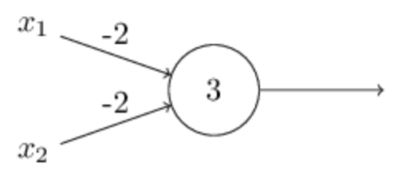

复杂一些的感知机由简单的感知机单元组合而成,这种就叫做多层感知机。

    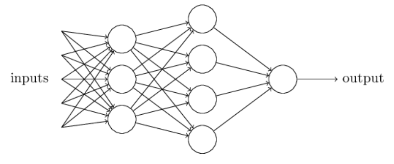

#### 多层感知机（MLP）

多层感知机由感知机推广而来，最主要的特点是有多个神经元层，最先输入的是输入层，中间是隐藏层，最后是输出层。其中隐藏层神经元会与前一层和下一层的神经元完全连接。

    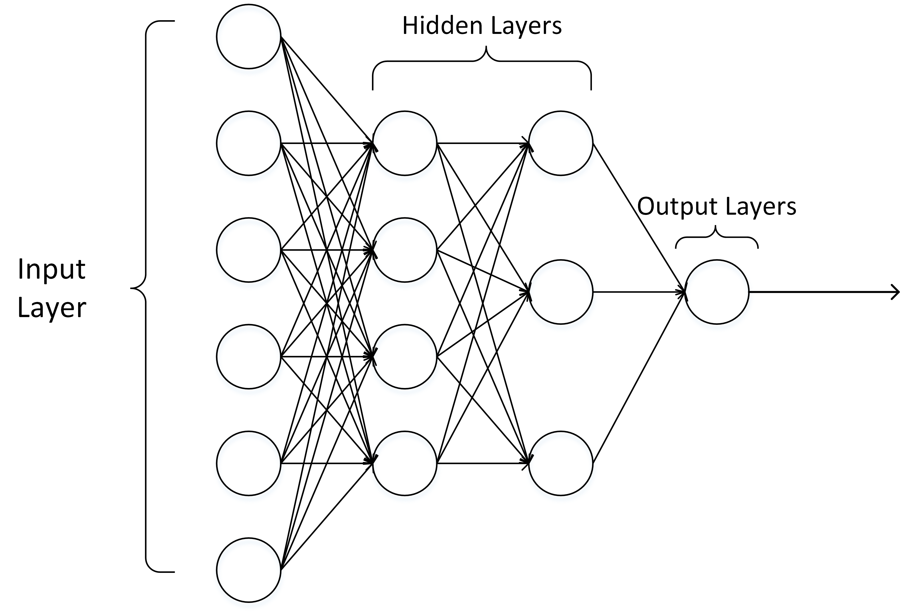

输入层的神经元数量是任意的。输出层也可以不止是1个神经元，可以是任意数量。隐藏层可以只有1层，也可以有任意数量的层。在设计网络的时候会根据需求调整。

    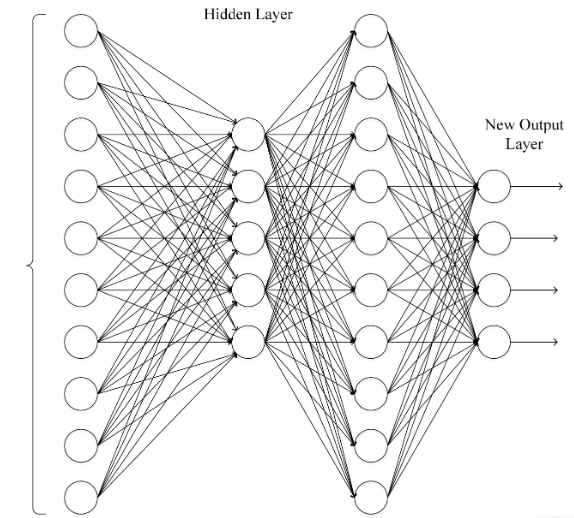

MLP是最简单的模型，表达能力有限，实际上目前各个领域所用到深度学习的模型框架非常复杂，参数量巨大。不过许多模型中都必须存在MLP，因此掌握该原理非常重要。

### 1.4 激活函数

激活函数(Activation functions)对于人工神经网络 模型去学习、理解非常复杂和非线性的函数来说具有十分重要的作用。它们将非线性特性引入到我们的网络中。如下图，在神经元中，输入的inputs 通过加权，求和后，还被作用了一个函数，这个函数就是激活函数。引入激活函数是为了增加神经网络模型的非线性。没有激活函数的每层都相当于矩阵相乘。就算你叠加了若干层之后，得到的只是线性的结果！ 
因此，激活函数都是非线性函数。

**为什么激活函数需要非线性函数?**

1. 假若网络中全部是线性部件，那么线性的组合还是线性，与单独一个线性分类器无异。这样就做不到用非线性来逼近任意函数，
2. 使用非线性激活函数 ，以便使网络更加强大，增加它的能力，使它可以学习复杂的事物，复杂的数据，以及表示输入输出之间非线性的复杂的任意函数映射。

常见的激活函数有

    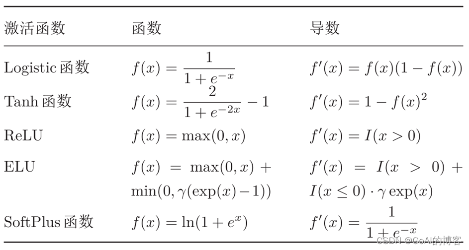

其中最常见的是ReLU函数,其特点是，对于小于0的数值直接归零，大于0的数值直接输出。

    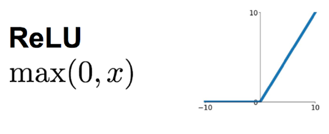

* ReLU优点： 
 　　ReLU近些年来在深度学习中使用得很多，可以解决梯度消失问题，ReLU函数就是一个取最大值函数，因为它的导数等于1或者就是0。相对于sigmoid和tanh激励函数，对ReLU求梯度非常简单，计算也很简单，可以非常大程度地提升随机梯度下降的收敛速度。（因为ReLU大于0的部分是线性的，而sigmoid和tanh是非线性的）。所以它有以下几大优点： 
    1，解决了gradient vanishing （梯度消失）问题（在正区间） 
    2，计算方便，求导方便，计算速度非常快，只需要判断输入是否大于0 
    3，收敛速度远远大于 Sigmoid函数和 tanh函数，可以加速网络训练 

* ReLU缺点： 
　　但ReLU的缺点是比较脆弱，随着训练的进行，可能会出现神经元死亡的情况，例如有一个很大的梯度流经ReLU单元后，那权重的更新结果可能是0，在此之后任何的数据点都没有办法再激活它了。如果发生这种情况，那么流经神经元的梯度从这一点开始将永远是0。也就是说，ReLU神经元在训练中不可逆地死亡了。所以它的缺点如下： 
    1，由于负数部分恒为零，会导致一些神经元无法激活 
    2，输出不是以0为中心 

    在实践中，ReLU的缺点影响不大。但在特殊场景建议使用其他激活函数。

### 1.5 前向传播、损失函数和反向传播 

神经网络的计算主要有两种:前向传播(foward propagation,FP)作用于每一层的输入，通过逐层计算得到输出结果;反向传播(backward propagation,BP)作用于网络的输出，通过计算梯度由后到前更新网络参数。 
其中损失函数起到了在两个环节中的桥梁作用。前向传播中，损失函数衡量了前向传播的预测结果和真实标签的差异。反向传播中，基于对前向过程的损失函数计算出的差异进行求导，往损失函数数值下降的方向求梯度，从而更新模型参数、。

前向传播是指**从输入数据开始**，通过神经网络的各层逐层计算并传递数据，最终得到模型的输出结果。在前向传播过程中，输入数据通过每一层的权重和偏置进行线性变换，并经过激活函数进行非线性变换，然后输出到下一层，直到达到输出层。前向传播的目的是计算模型的预测值。

    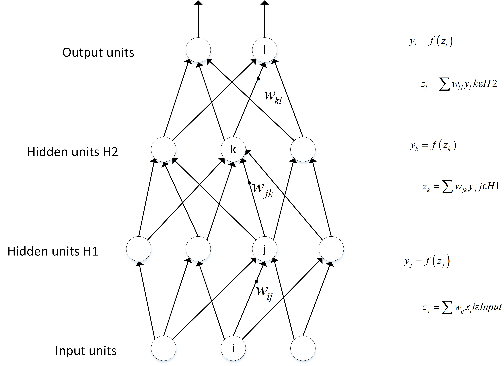

在得到前向传播的预测结果后，可以用损失函数来对比预测结果和真实结果的差异。为了方便，这里仅仅简单介绍最简单的Mean Square Error(MSE)-均方差损失函数。 
均方误差（MSE）计算的是预测值与真实值之间差的平方的平均值。如果预测的结果偏差大，则损失函数的值就会大，偏差越小，损失函数越趋近于0。这里把算是函数记为loss_fn(yi,Yi)。y是预测，Y是真实。

    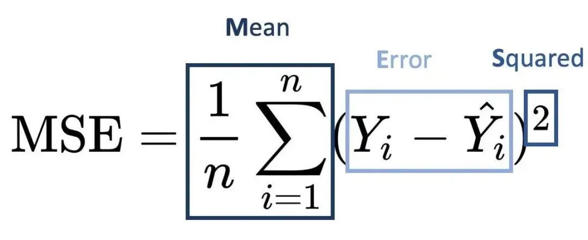

反向传播是指根据模型的**预测结果和真实标签之间的差异**，通过梯度求导中的链式法则（Chain Rule）逆向计算梯度，并将梯度从输出层传播回网络的每一层，用于更新模型的参数。在反向传播过程中，首先计算输出层的误差，然后将误差从输出层传播到隐藏层，再传播到更浅的隐藏层，直到传播到输入层。通过反向传播，可以获取关于每个参数对损失函数的梯度信息，从而实现参数的优化和更新。这一部分理解起来可能会存在难度。

    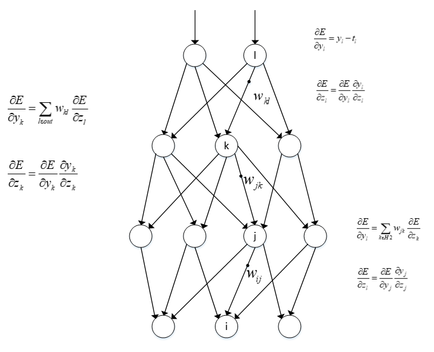

反向传播是为了让损失函数变小。数学中，对一个函数可求导函数，也就是梯度。当该点梯度为负数，只要往该方向更新，即可得到比原来该点数值更小的数值。因此，我们只需要通过对损失函数求梯度，更新模型参数，即可得到一个预测能力更强，使得损失值更小的模型！下图中的f(x)实际上是损失函数，θ是模型的参数，即神经元的权重w和偏置b。未得到训练的模型的θ预测不准，使得损失值较大，通过反向传播，求导得到θ的更新值，得到新θ，即新的模型。通过多次训练，模型的θ逐渐更新，损失值越来越小。最终损失值收敛，我们可以停止训练。

    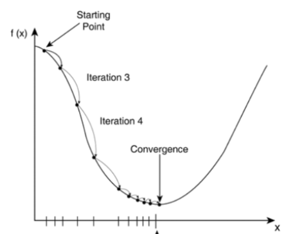

## 2 深度学习的应用

深度学习凭借其强大的特征提取与表示学习能力，已广泛应用于众多领域，并持续推动技术进步和产业变革。其核心优势在于能够处理**高维、复杂、非结构化**的数据（如图像、语音、文本），并自动学习其中的层次化抽象特征，而无需过多依赖人工设计的规则。

### 2.1 计算机视觉（CV）

这是深度学习最早取得突破性成功的领域之一。
*   **图像分类与识别**：识别图像中的主要物体或场景（如猫、狗、汽车），经典数据集包括ImageNet。模型如ResNet、EfficientNet。
*   **目标检测**：不仅识别物体，还要定位其在图像中的位置（框出边界框）。广泛应用于自动驾驶、视频监控。代表模型：YOLO系列、Faster R-CNN。
*   **图像分割**：将图像中的每个像素进行分类，划分出不同的物体或区域。分为语义分割（区分类别）和实例分割（区分个体）。用于医疗影像分析、自动驾驶场景理解。模型如U-Net、Mask R-CNN。
*   **图像生成**：根据描述或随机噪声生成全新的、逼真的图像。如DALL-E、Stable Diffusion、Midjourney等生成式AI的核心技术。
*   **人脸识别**：用于身份验证、安防和社交媒体应用。
*   **图像超分辨率**：从低分辨率图像重建高分辨率细节。

### 2.2 自然语言处理 (NLP)

深度学习彻底改变了NLP领域，使机器能更好地理解和生成人类语言。
*   **机器翻译**：实现不同语言间高质量的自动翻译，如谷歌翻译、DeepL。
*   **文本生成**：创作文章、诗歌、代码、对话等。代表模型：GPT系列、BERT（更擅长理解）、T5等大语言模型。
*   **情感分析**：判断一段文本（如评论、推文）所表达的情感倾向（正面、负面、中性）。
*   **问答系统与智能客服**：理解用户问题并从知识库或文档中提取答案，如智能助手。
*   **语音识别与合成**：将语音转换为文本（ASR）或将文本转换为自然语音（TTS），如Siri、小爱同学。

### 2.3 语音与音频处理
*   **语音识别**：将人类语音实时转换为可操作的文本指令，是智能家居、车载系统、会议纪要的核心。
*   **说话人识别**：识别或验证说话人的身份。
*   **音频生成**：生成音乐、音效或特定人声的语音。

### 2.4 推荐系统
深度学习通过分析用户的历史行为（点击、购买、观看）、物品特征和上下文信息，学习复杂的用户偏好，实现更精准的个性化推荐。广泛应用于电商（淘宝、亚马逊）、视频平台（Netflix、YouTube）、新闻资讯等。

### 2.5 游戏与强化学习
*   **游戏AI**：深度学习与强化学习结合，训练出能在复杂环境中做出决策的AI，如AlphaGo（围棋）、AlphaStar（星际争霸）、OpenAI Five（Dota2），它们通过自我对弈达到超人类水平。
*   **机器人控制**：让机器人学习行走、抓取等复杂技能。

### 2.6 科学与医疗健康
*   **药物发现**：预测分子性质、生成新的候选药物分子、加速药物研发流程。
*   **医疗影像分析**：辅助医生从X光、CT、MRI、病理切片中检测病灶（如肿瘤）、进行分割和诊断，提高准确性和效率。
*   **基因组学**：分析DNA序列，预测基因功能与疾病关联。

### 2.7 其他领域
*   **自动驾驶**：融合计算机视觉、传感器数据处理和决策控制，实现环境感知、路径规划和车辆控制。
*   **金融科技**：用于欺诈检测、 algorithmic trading、信用风险评估和客户服务。
*   **艺术与创作**：辅助音乐、绘画、设计等创意工作。

**引用**

1、<a href="https://blog.csdn.net/qq_36816848/article/details/122286610?ops_request_misc=elastic_search_misc&request_id=3dbeb8de1a92bac5a2a8c390c96f3bbd&biz_id=0&utm_medium=distribute.pc_search_result.none-task-blog-2~all~top_positive~default-1-122286610-null-null.142^v102^pc_search_result_base7&utm_term=%E6%B7%B1%E5%BA%A6%E5%AD%A6%E4%B9%A0&spm=1018.2226.3001.4187">深度学习知识点全面总结</a> 
2、<a href="https://blog.csdn.net/python1222_/article/details/143233184?ops_request_misc=elastic_search_misc&request_id=8731afce26d26da65d5a71bdf89d7c15&biz_id=0&utm_medium=distribute.pc_search_result.none-task-blog-2~all~top_click~default-2-143233184-null-null.142^v102^pc_search_result_base7&utm_term=%E6%8D%9F%E5%A4%B1%E5%87%BD%E6%95%B0&spm=1018.2226.3001.4187">一文彻底搞懂深度学习 - 损失函数</a> 
3、<a href="https://blog.csdn.net/ft_sunshine/article/details/90221691?ops_request_misc=elastic_search_misc&request_id=3c183f14e01d7e1abb59d669f66240d3&biz_id=0&utm_medium=distribute.pc_search_result.none-task-blog-2~all~top_positive~default-1-90221691-null-null.142^v102^pc_search_result_base7&utm_term=%E5%8F%8D%E5%90%91%E4%BC%A0%E6%92%AD&spm=1018.2226.3001.4187">“反向传播算法”过程及公式推导</a> 

    <a href="../01_Python介绍/1_12_常见库介绍.html" style="text-decoration: none; color: #0366d6; padding: 8px 15px; border: 1px solid #e1e4e8; border-radius: 5px;">👈 上一页</a>
    <a href="../index.html" style="text-decoration: none; color: #0366d6; padding: 8px 15px; border: 1px solid #e1e4e8; border-radius: 5px;">🏠 首页</a>
    <a href="./2_2_数据集.html" style="text-decoration: none; color: #0366d6; padding: 8px 15px; border: 1px solid #e1e4e8; border-radius: 5px;">下一页 👉</a>

