# 2_3_损失函数

**作者**: ZhouLong 
**创建日期**: 2026 年 02 月 06 日 
**版本**: 1.0 

    <a href="./2_2_数据集.html" style="text-decoration: none; color: #0366d6; padding: 8px 15px; border: 1px solid #e1e4e8; border-radius: 5px;">👈 上一页</a>
    <a href="../index.html" style="text-decoration: none; color: #0366d6; padding: 8px 15px; border: 1px solid #e1e4e8; border-radius: 5px;">🏠 首页</a>
    <a href="./2_4_优化器.html" style="text-decoration: none; color: #0366d6; padding: 8px 15px; border: 1px solid #e1e4e8; border-radius: 5px;">下一页 👉</a>

## 1 **损失函数是什么**

损失函数（Loss Function）这个是深度学习模型训练中的核心概念，用于衡量模型预测结果与真实标签之间的误差或差距。<b>训练模型的本质就是为了降低损失函数的值</b>。

相关概念在`2_1_深度学习简介`中有介绍基础原理，本篇侧重系统介绍损失函数都有哪些，原理有哪些。不同任务一般会运用特定的损失函数，如回归任务，分类任务，排序任务等。因此掌握好损失函数，才可以构建恰当的模型来解决特定的问题。

<b>建议</b>

本篇文档主要参考论文<a href="https://arxiv.org/abs/2307.02694" target="_blank" >LOSS FUNCTIONS AND METRICS IN DEEP LEARNING</a>，读者有兴趣可深入阅读论文

## 2 **损失函数的性质**

损失函数通过优化器中的优化算法来调整模型参数以最小化这一差异。损失函数的选择直接影响模型的训练效果、收敛速度和泛化能力。以下是损失函数应具备的几个重要性质。

损失函数（Loss Function）在深度学习中扮演着核心角色，它用于衡量模型预测值与真实值之间的差异，并通过优化算法（如梯度下降）来调整模型参数以最小化这一差异。损失函数的选择直接影响模型的训练效果、收敛速度和泛化能力。以下是损失函数应具备的几个重要性质，及其在深度学习中的意义：

### 2.1. 凸性（Convexity）
- **定义**：如果损失函数在其定义域内是凸函数，则任何局部最小值都是全局最小值。
- **重要性**：凸损失函数更容易优化，因为梯度下降等优化算法能够稳定地收敛到全局最优解，避免陷入局部极小值。

### 2.2 可微性（Differentiability）
- **定义**：损失函数在其定义域内是可导的，即存在连续梯度。
- **重要性**：梯度下降等基于梯度的优化算法依赖于损失函数对模型参数的导数。如果损失函数不可微，则无法直接使用这些方法。
- **常见例子**：MSE 处处可导；而 MAE 由于在误差为零处不可导，基本只作为模型评估方法。

### 2.3 鲁棒性（Robustness）
- **定义**：损失函数对异常值不敏感，不会因为少数极端值而产生过大影响。
- **重要性**：在实际数据中，异常值难以避免。鲁棒的损失函数能减少这些值对模型训练的干扰，提高模型的稳定性。

### 2.4 平滑性（Smoothness）
- **定义**：损失函数的梯度连续变化，没有突变或陡峭的跳跃。
- **重要性**：平滑的损失函数能提供更稳定的梯度信息，有利于优化算法的收敛。

### 2.5 稀疏性（Sparsity）
- **定义**：损失函数能鼓励模型输出稀疏解，即只有少数特征或参数对预测有贡献。
- **重要性**：在高维数据或特征选择任务中，稀疏性有助于提高模型的解释性和泛化能力。

### 2.6 单调性（Monotonicity）
- **定义**：损失函数值随预测值接近真实值而单调递减。
- **重要性**：单调性保证了优化过程是朝着正确的方向进行的，即减少误差会降低损失。

## 3 **回归任务的损失函数**

回归任务中常用的损失函数主要包括以下几种，每种都有其特定的数学形式、性质、适用场景与优缺点：

---

### 3.1 均方误差

均方误差，又称为`Mean Squared Error`, `MSE`, `L2 Loss`
- **公式**：

    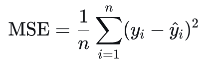

- **特点**：
  - 对**大误差**惩罚更重（平方项），因此对**异常值敏感**。
  - 处处可微，易于使用梯度下降法优化。
  - 是**凸函数**（在线性模型中），有利于找到全局最优解。
- **适用场景**：
  - 数据分布接近高斯分布、异常值较少。
  - 常用于线性回归、神经网络回归任务。
- **局限性**：
  - 对异常值敏感，可能导致模型不稳定。
  - 结果受目标变量尺度影响，不易跨数据集比较。

---

### 3.2 平均绝对误差

平均绝对误差，又称为`Mean Absolute Error`, `MAE`, `L1 Loss`。其和MSE的区别在于内部的核不是求差的平方，而是差的绝对值。
- **公式**：

    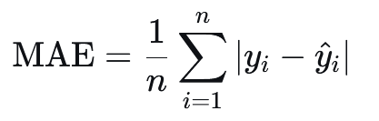

- **特点**：
  - 对异常值**更稳健**，因为误差是线性惩罚。
  - 在误差为0处不可微，但可用次梯度方法优化。
  - 输出的是预测值与真实值的**中位数关系**。
- **适用场景**：
  - 数据中存在异常值或误差分布不对称。
  - 适用于对异常值敏感的应用（如金融预测）。
- **局限性**：
  - 优化可能比MSE慢，因为梯度恒定。
  - 同样受尺度影响。

---

### 3.3 Huber Loss
- **公式**：

    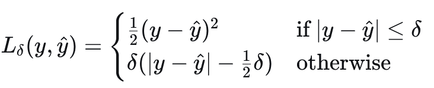

- **特点**：
  - 结合了**MSE和MAE**的优点：对小误差使用二次惩罚，对大误差使用线性惩罚。
  - 通过超参数 `δ` 控制“误差”的阈值。
  - 对异常值比MSE更稳健，同时保持可微性。
- **适用场景**：
  - 数据中有少量异常值，但仍希望保持平滑优化。
  - 常用于稳健回归和时间序列预测。
- **局限性**：
  - 需要调参 `δ`，影响模型表现。

---

### 3.4 Log-Cosh Loss
- **公式**：

    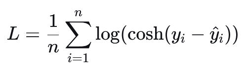

- **其中**：
  - cosh 是双曲余弦函数
  - ⁡log 是自然对数

    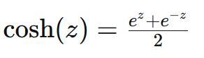

- **特点**：
  - 近似于Huber Loss，但处处可微且无需阈值参数。
  - 对小误差近似为二次函数，对大误差近似为线性。
  - 比MSE更稳健，比Huber更平滑。
- **适用场景**：
  - 希望使用一个**完全可微且稳健**的损失函数。
  - 适用于深度学习中的复杂回归任务。
- **局限性**：
  - 计算量略高于MSE/MAE。
  - 对小误差的惩罚可能比Huber更强。

---

### 3.5 分位数损失

分位数损失，又称为Quantile Loss

- **公式**：

    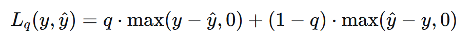

- **特点**：
  - 用于预测**分位数**而不仅仅是平均值。
  - 可对不同方向误差（高估 vs 低估）赋予不同权重。
  - 当 \(q=0.5\) 时，等价于MAE。
- **适用场景**：
  - 需要预测**区间**或**风险估计**（如金融风险VaR）。
  - 适用于不对称成本的任务（如库存预测、医疗预后）。
- **局限性**：
  - 在误差为0处不可微。
  - 需要选择合适的分位数 \(q\)。

---

### 3.6 泊松损失

泊松损失，又称为Poisson Loss
- **公式**：

    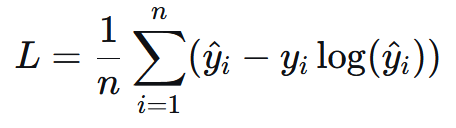

- **特点**：
  - 假设目标变量服从**泊松分布**（非负整数计数数据）。
  - 通常配合指数链接函数使用，确保预测值为正。
- **适用场景**：
  - 计数数据预测（如交通事故数、疾病病例数、网站访问量）。
- **局限性**：
  - 假设数据服从泊松分布，可能不适用于过度离散数据。

---

## 4 **分类任务的损失函数**

在分类任务中，一般模型需要完成C分类的任务，则需要设置输出层有C个神经元。此时模型输出的向量被称作logits向量，logits向量需要通过 Softmax 函数 转换为概率分布。Softmax 函数如下：

    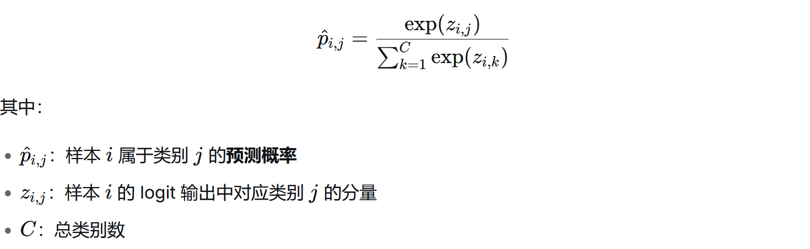

由此我们可以得到某个分类的预测概率。

---

### 4.1 二元交叉熵损失

又称为Binary Cross-Entropy Loss, BCE。BCE是深度学习中用于`二分类`任务的核心损失函数，它衡量的是二元概率分布之间的差异。

- **公式**：

    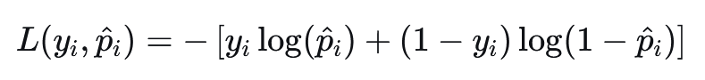

在实践中，一般都是使用多个样本的平均。

    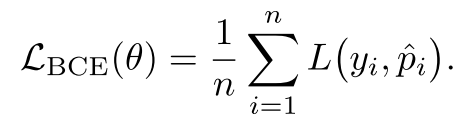

- **特点**：
  - 基于信息论，衡量两个伯努利分布之间的距离。
  - 对预测错误的样本进行**高惩罚**，尤其是预测过于自信时。
  - 可通过加权处理类别不平衡问题。
- **适用场景**：
  - 二分类任务，如逻辑回归、二元图像分割。
  - 标签为 {0, 1} 的分类问题。
- **局限性**：
  - 对类别不平衡敏感，可能需要加权或使用 Focal Loss。
  - 在训练初期容易受到梯度饱和问题影响。

---

### 4.2 分类交叉熵损失

又称为Categorical Cross-Entropy Loss, CCE。CCE是深度学习中经常用于`多分类`任务的核心损失函数。其标签要以onehot编码的形式进行计算。
- **公式**：

    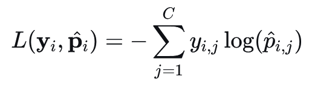

通过对n个样本取平均得到

    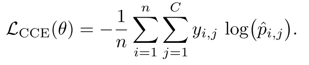

- **特点**：
  - 适用于多分类任务，通常与 Softmax 输出层结合。
  - 鼓励模型将高概率分配给正确类别。
  - 对预测错误的类别进行指数级惩罚。
- **适用场景**：
  - 多分类任务，如图像分类、文本分类。
  - 标签为 one-hot 编码形式，单标签。
- **局限性**：
  - 对类别不平衡敏感。
  - 需要显式的 one-hot 编码，可能内存消耗较大。

---

### 4.3 稀疏分类交叉熵损失

Sparse Categorical Cross-Entropy Loss 是深度学习中用于多分类任务的一种损失函数，特别适用于标签以整数形式（如 0, 1, 2, ...）而不是 one-hot 编码形式表示的情况。它是 CCE 的一种内存高效变体。
- **公式**：

    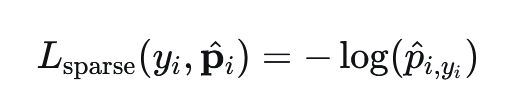

通过对n个样本取平均得到

    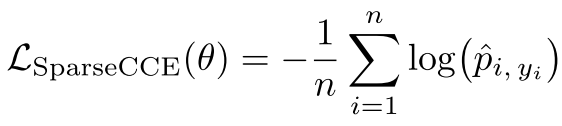

- **特点**：
  - 适用于标签为整数形式（而非 one-hot）的多分类任务。
  - 内存效率更高，无需构建完整 one-hot 矩阵。
- **适用场景**：
  - 类别数量较多且标签为整数的任务，如自然语言处理中的词分类。
- **局限性**：
  - 仅适用于整数标签，不适用于概率形式的目标。
  - 依然受类别不平衡影响。

---

### 4.4 加权交叉熵损失

又称为Weighted Cross-Entropy Loss, WCE。WCE是CCE的一个变体，专门用于处理类别不平衡问题。通过为不同类别分配不同的权重，它使模型能够更关注少数类或代价更高的错误分类。通过观察WCE和CCE的公式，可以发现核心区别就是WCE多了`α`的超参数作为权重。
- **公式**：

    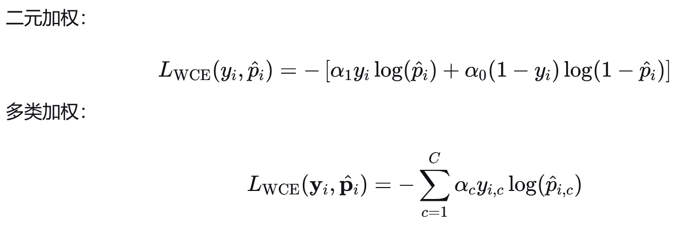

注意实践中要对n样本取平均，这里就不写求平均公式了。

- **特点**：
  - 通过类别权重缓解类别不平衡问题。
  - 权重通常设置为类别频率的倒数或基于错误成本。
- **适用场景**：
  - 类别严重不平衡的分类任务，如医疗图像诊断。
  - 多标签分类任务中不同标签重要性不同。
- **局限性**：
  - 权重选择需要经验或调参。
  - 过大的权重可能导致训练不稳定。

---

### 4.5 标签平滑交叉熵损失

又称为Cross-Entropy Loss with Label Smoothing。标签平滑是一种正则化技术，用于防止分类模型对训练数据过度自信（over-confident）。它通过"软化"原本的 onehot 硬标签，为模型训练引入不确定性，从而提高泛化能力。然后对软化的onehot用CCE进行损失计算。

软化的例子： 
传统 one-hot 标签：[0,0,1,0] 
标签平滑后：[0.02,0.02,0.92,0.02]

- **公式**：

    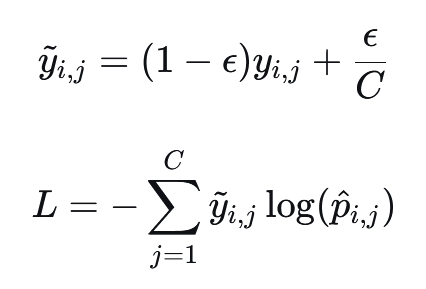

    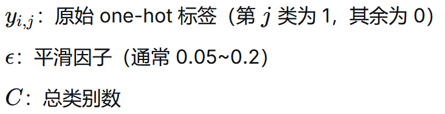

- **特点**：
  - 缓解模型对训练集的**过度自信**。
  - 提高模型的泛化能力，减少过拟合。
- **适用场景**：
  - 大规模分类任务。
  - 训练数据中存在噪声或标签不确定的情况。
- **局限性**：
  - 需要调整平滑参数 `ε`。
  - 可能降低对少数类的敏感度。

---

### 4.6 负对数似然损失

又称为Negative Log-Likelihood Loss, NLL。NLL的核心思想是：最大化真实类别出现的概率等价于最小化负对数似然。当真实标签是 onehot 编码时，NLL与CCE完全等价！与CCE的区别是，标签是概率分布/软标签的条件下二者不一致。
- **公式**：

    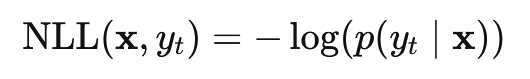

- **特点**：
  - 与CCE在 onehot 标签下等价。
  - 直接最大化真实类别的对数似然。
- **适用场景**：
  - 分类任务中作为交叉熵的替代形式。
  - 适用于概率输出与 one-hot 标签匹配的场景。
  - 单标签，即标签之间互斥。
- **局限性**：
  - 对类别不平衡敏感。
  - 预测过于自信时梯度可能爆炸。

---

### 4.7 PolyLoss

PolyLoss 是一种多项式扩展的损失函数框架，它将常用的多种分类损失（如CEE、Focal Loss）统一到一个多项式表达式中。通过调整多项式系数，可以灵活控制模型对不同难度样本的关注程度。
- **公式**：
Poly-1损失：它在标准交叉熵的顶部添加了一个线性项。 
一般公式：设`pt`是对某个样本的真实类别t的预测概率。 

    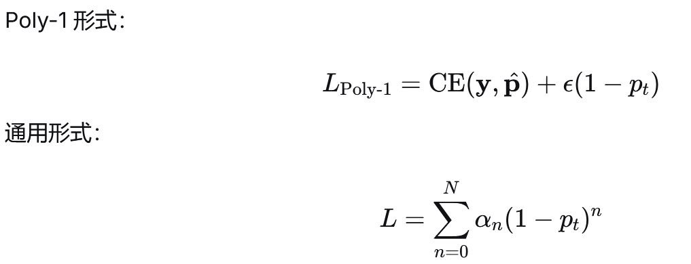

- **特点**：
  - 通过多项式扩展统一了交叉熵和 Focal Loss。
  - 可通过调整系数控制对不同误差的敏感度。
- **适用场景**：
  - 类别不平衡严重的任务。
  - 需要对不同错误类型进行精细控制的分类任务。
- **局限性**：
  - 需要调参以确定最佳多项式系数。
  - 实现复杂度高于标准交叉熵。

---

### 4.8 合页损失

合页损失（Hinge Loss），也称为间隔损失（Margin Loss），是一种主要用于二分类任务的损失函数。它的核心思想是最大化分类间隔，不仅要求分类正确，还要求分类具有足够的"安全裕度"。
对于二分类任务，标签通常编码为 y∈{−1,+1}，模型输出的logits为 f(x)：
- **公式**：

    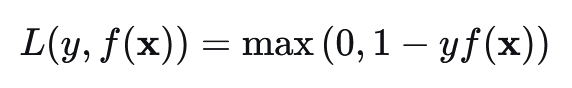

其中： 
`1`是间隔参数（margin），是可以调整的。

- **特点**：
  - 鼓励**间隔最大化**，不仅要 y⋅f(x)>0（正确分类），还要 y⋅f(x)≥1（有足够间隔）。
  - 对正确分类但间隔不足的样本仍施加惩罚。
- **适用场景**：
  - 二分类任务，尤其是线性可分或近似可分的数据。
  - 结构化输出任务（如多分类 SVM）。
- **局限性**：
  - 不输出概率，仅输出分类决策。
  - 对噪声和异常值敏感。

    <a href="./2_2_数据集.html" style="text-decoration: none; color: #0366d6; padding: 8px 15px; border: 1px solid #e1e4e8; border-radius: 5px;">👈 上一页</a>
    <a href="../index.html" style="text-decoration: none; color: #0366d6; padding: 8px 15px; border: 1px solid #e1e4e8; border-radius: 5px;">🏠 首页</a>
    <a href="./2_4_优化器.html" style="text-decoration: none; color: #0366d6; padding: 8px 15px; border: 1px solid #e1e4e8; border-radius: 5px;">下一页 👉</a>

