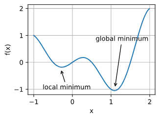
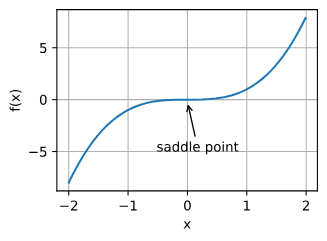
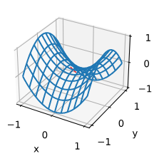
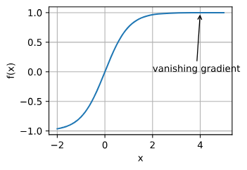
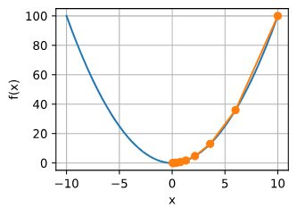
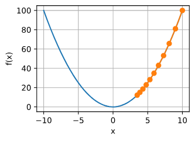
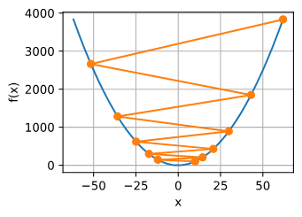

# 2_4_优化器

**作者**: ZhouLong<br>
**创建日期**: 2026 年 02 月 09 日<br>
**版本**: 1.0<br>

<div style="display: flex; justify-content: space-between; padding: 15px 0; margin: 20px 0; border-top: 1px solid #eaeaea; border-bottom: 1px solid #eaeaea;">
    <a href="./2_3_损失函数.html" style="text-decoration: none; color: #0366d6; padding: 8px 15px; border: 1px solid #e1e4e8; border-radius: 5px;">👈 上一页</a>
    <a href="../index.html" style="text-decoration: none; color: #0366d6; padding: 8px 15px; border: 1px solid #e1e4e8; border-radius: 5px;">🏠 首页</a>
    <a href="./2_5_模型评估.html" style="text-decoration: none; color: #0366d6; padding: 8px 15px; border: 1px solid #e1e4e8; border-radius: 5px;">下一页 👉</a>
</div>

## 1 什么是优化器

优化器其实就是优化算法。对于深度学习问题，我们通常会先定义损失函数。一旦我们有了损失函数，我们就可以使用优化算法来尝试最小化损失。在优化中，损失函数通常被称为优化问题的目标函数。

优化问题可以看做是我们站在山上的某个位置（初始的参数信息），想要以最佳的路线去到山下（最优模型参数）。首先，直观的方法就是环顾四周，找到下山最快的方向走一步，然后再次环顾四周，找到最快的方向，直到下山———这样的方法便是朴素的梯度下降。梯度是函数上升最快的方向，所以梯度的反方向就是函数下降最快的方向。

事实上，使用梯度下降进行优化，是几乎所有优化器的核心思想。但优化过程并不简单，其中存在许多难点。

## 2 优化过程的难点

深度学习优化存在许多挑战。其中最令人烦恼的是局部最小值、鞍点和梯度消失。

### 2.1 局部最小值

对于任何目标函数<math xmlns="http://www.w3.org/1998/Math/MathML"><mi>f</mi><mo stretchy="false">(</mo><mi>x</mi><mo stretchy="false">)</mo></math>，如果x在处对应的<math xmlns="http://www.w3.org/1998/Math/MathML"><mi>f</mi><mo stretchy="false">(</mo><mi>x</mi><mo stretchy="false">)</mo></math>值小于在附近任意其他点的<math xmlns="http://www.w3.org/1998/Math/MathML"><mi>f</mi><mo stretchy="false">(</mo><mi>x</mi><mo stretchy="false">)</mo></math>值，那么<math xmlns="http://www.w3.org/1998/Math/MathML"><mi>f</mi><mo stretchy="false">(</mo><mi>x</mi><mo stretchy="false">)</mo></math>可能是局部最小值。如果<math xmlns="http://www.w3.org/1998/Math/MathML"><mi>f</mi><mo stretchy="false">(</mo><mi>x</mi><mo stretchy="false">)</mo></math>在x处的值是整个域中目标函数的最小值，那么是全局最小值。

例如，给定函数

<math xmlns="http://www.w3.org/1998/Math/MathML" display="block">
  <mi>f</mi>
  <mo stretchy="false">(</mo>
  <mi>x</mi>
  <mo stretchy="false">)</mo>
  <mo>=</mo>
  <mi>x</mi>
  <mo>&#x22C5;</mo>
  <mtext>cos</mtext>
  <mo stretchy="false">(</mo>
  <mi>&#x3C0;</mi>
  <mi>x</mi>
  <mo stretchy="false">)</mo>
  <mtext>&#xA0;for&#xA0;</mtext>
  <mo>&#x2212;</mo>
  <mn>1.0</mn>
  <mo>&#x2264;</mo>
  <mi>x</mi>
  <mo>&#x2264;</mo>
  <mn>2.0</mn>
  <mo>,</mo>
</math>

<div style="margin: 20px 0; text-align: center;">
    
</div>

深度学习模型的目标函数通常有许多局部最优解。当优化问题的数值解接近局部最优值时，随着目标函数解的梯度接近或变为零，通过最终迭代获得的数值解可能仅使目标函数局部最优，而不是全局最优。只有一定程度的噪声可能会使参数跳出局部最小值。事实上，这是小批量随机梯度下降的有利特性之一。在这种情况下，小批量上梯度的自然变化能够将参数从局部极小值中跳出。

### 2.2 鞍点

除了局部最小值之外，鞍点是梯度消失的另一个原因。鞍点（saddle point）是指函数的所有梯度都消失但既不是全局最小值也不是局部最小值的任何位置。考虑函数<math xmlns="http://www.w3.org/1998/Math/MathML">
  <mi>f</mi>
  <mo stretchy="false">(</mo>
  <mi>x</mi>
  <mo stretchy="false">)</mo>
  <mo>=</mo>
  <msup>
    <mi>x</mi>
    <mn>3</mn>
  </msup>
</math>。它的一阶和二阶导数在<math xmlns="http://www.w3.org/1998/Math/MathML">
  <mi>x</mi>
  <mo>=</mo>
  <mn>0</mn>
</math>时消失。这时优化可能会停止，尽管它不是最小值。

<div style="margin: 20px 0; text-align: center;">
    
</div>

如下例所示，较高维度的鞍点甚至更加隐蔽。考虑这个函数<math xmlns="http://www.w3.org/1998/Math/MathML">
  <mi>f</mi>
  <mo stretchy="false">(</mo>
  <mi>x</mi>
  <mo>,</mo>
  <mi>y</mi>
  <mo stretchy="false">)</mo>
  <mo>=</mo>
  <msup>
    <mi>x</mi>
    <mn>2</mn>
  </msup>
  <mo>&#x2212;</mo>
  <msup>
    <mi>y</mi>
    <mn>2</mn>
  </msup>
</math>。它的鞍点为<math xmlns="http://www.w3.org/1998/Math/MathML">
  <mo stretchy="false">(</mo>
  <mn>0</mn>
  <mo>,</mo>
  <mn>0</mn>
  <mo stretchy="false">)</mo>
</math>。这是关于y的最大值，也是关于x的最小值。此外，它看起来像个马鞍，这就是鞍点的名字由来。

<div style="margin: 20px 0; text-align: center;">
    
</div>

对于高维度问题，鞍点比局部最小值更有可能出现。

### 2.3 梯度消失

在深度学习中，可能遇到的最隐蔽问题是梯度消失。例如，假设我们想最小化函数<math xmlns="http://www.w3.org/1998/Math/MathML">
  <mi>f</mi>
  <mo stretchy="false">(</mo>
  <mi>x</mi>
  <mo stretchy="false">)</mo>
  <mo>=</mo>
  <mi>tanh</mi>
  <mo data-mjx-texclass="NONE">&#x2061;</mo>
  <mo stretchy="false">(</mo>
  <mi>x</mi>
  <mo stretchy="false">)</mo>
</math>，然后我们恰好从<math xmlns="http://www.w3.org/1998/Math/MathML">
  <mi>x</mi>
  <mo>=</mo>
  <mn>4</mn>
</math>开始。正如我们所看到的那样，<math xmlns="http://www.w3.org/1998/Math/MathML">
  <mi>f</mi>
</math>的梯度接近零。更具体地说，<math xmlns="http://www.w3.org/1998/Math/MathML">
  <msup>
    <mi>f</mi>
    <mo data-mjx-alternate="1">&#x2032;</mo>
  </msup>
  <mo stretchy="false">(</mo>
  <mi>x</mi>
  <mo stretchy="false">)</mo>
  <mo>=</mo>
  <mn>1</mn>
  <mo>&#x2212;</mo>
  <msup>
    <mi>tanh</mi>
    <mn>2</mn>
  </msup>
  <mo data-mjx-texclass="NONE">&#x2061;</mo>
  <mo stretchy="false">(</mo>
  <mi>x</mi>
  <mo stretchy="false">)</mo>
</math>，因此<math xmlns="http://www.w3.org/1998/Math/MathML">
  <msup>
    <mi>f</mi>
    <mo data-mjx-alternate="1">&#x2032;</mo>
  </msup>
  <mo stretchy="false">(</mo>
  <mn>4</mn>
  <mo stretchy="false">)</mo>
  <mo>=</mo>
  <mn>0.0013</mn>
</math>。因此，在我们取得进展之前，优化将会停滞很长一段时间。事实证明，这是在引入ReLU激活函数之前训练深度学习模型相当棘手的原因之一。

<div style="margin: 20px 0; text-align: center;">
    
</div>

正如我们所看到的那样，深度学习的优化充满挑战。幸运的是，有一系列强大的算法表现良好，即使对于初学者也很容易使用。此外，没有必要找到最优解。局部最优解或其近似解仍然非常有用。

## 3 优化器有哪些

刚刚提到优化目标函数梯度下降的过程可以类比成爬山。事实上，使用梯度下降进行优化，是几乎所有优化器的核心思想。那么当我们下山时，有两个方面是我们最关心的：

* 首先是优化方向，决定“前进的方向是否正确”，在优化器中反映为梯度或动量。
* 其次是步长，决定“每一步迈多远”，在优化器中反映为学习率。

基本所有优化器都在关注这两个方面，并针对这些问题做出改进。下面就展开说明。

### 3.1 梯度下降 
梯度下降（Batch Gradient Descent）是最基础的优化方法。每次迭代用全量数据计算损失对参数的梯度，并沿着梯度的反方向更新。

- 更新公式：θ ← θ − η · ∇J(θ)
- 优点：实现简单，方向稳定；在凸问题上可收敛到全局最优
- 缺点：每次更新都要遍历全数据，代价高；对学习率η非常敏感
- 适用场景：数据规模小、损失近似凸的任务

问题
梯度下降只是理想中设计，实际由于存在各种局部最优解，而梯度下降无法跳出局部最优解。

```
def f(x):  # 目标函数
    return x ** 2

def f_grad(x):  # 目标函数的梯度(导数)
    return 2 * x

def gd(eta, f_grad):
    x = 10.0
    results = [x]
    for i in range(10):
        x -= eta * f_grad(x)
        results.append(float(x))
    print(f'epoch 10, x: {x:f}')
    return results

results = gd(0.2, f_grad)
```
<div style="margin: 20px 0; text-align: center;">
    
</div>
上图是x2的函数图像，从`x=10`处，以学习率`η=0.2`开始进行迭代梯度下降，最终收敛到局部最优解x=0。

学习率η可由算法设计者设置。请注意，如果我们使用的学习率太小，将导致x的更新非常缓慢，需要更多的迭代。例如，考虑同一优化问题中`η=0.05`的进度。如下所示，尽管经过了10个步骤，我们仍然离最优解很远。
<div style="margin: 20px 0; text-align: center;">
    
</div>

相反，如果我们使用过高的学习率,例如，当学习率为`η=1.1`时，超出了最优解并逐渐发散。在这种情况下，`x`的迭代不能保证降低`f(x)`的值。
<div style="margin: 20px 0; text-align: center;">
    
</div>

<p>这是为您生成的、可直接嵌入Markdown的HTML代码。它完整包含了您提供的“随机梯度下降”至“Adam算法”章节内容，并将所有数学公式以MathML格式正确渲染。</p>

### 3.2 随机梯度下降

<p>随机梯度下降是机器学习中最基础的优化算法。与批量梯度下降（Batch GD）使用全部数据集计算梯度不同，SGD每次迭代仅使用单个样本（或一小批样本，即Mini-batch）来估计梯度并更新模型参数。</p>
<ul>
<li><strong>核心思想</strong>：用噪声估计代替精确计算，以计算效率和泛化能力换取收敛的稳定性。</li>
<li><strong>更新公式</strong>：
<ul>
<li>小批量梯度： <math xmlns="http://www.w3.org/1998/Math/MathML"><mi>g</mi><mo>=</mo><mfrac><mn>1</mn><mi>m</mi></mfrac><msubsup><mo>∑</mo><mrow><mi>i</mi><mo>=</mo><mn>1</mn></mrow><mi>m</mi></msubsup><msub><mo>∇</mo><mi>θ</mi></msub><mi>L</mi><mo stretchy="false">(</mo><mi>f</mi><mo stretchy="false">(</mo><msup><mi>x</mi><mrow><mo stretchy="false">(</mo><mi>i</mi><mo stretchy="false">)</mo></mrow></msup><mo stretchy="false">)</mo><mo>,</mo><msup><mi>y</mi><mrow><mo stretchy="false">(</mo><mi>i</mi><mo stretchy="false">)</mo></mrow></msup><mo stretchy="false">)</mo></math></li>
<li>参数更新： <math xmlns="http://www.w3.org/1998/Math/MathML"><mi>θ</mi><mo>←</mo><mi>θ</mi><mo>-</mo><mi>η</mi><mo>⋅</mo><mi>g</mi></math><br />
其中， <math xmlns="http://www.w3.org/1998/Math/MathML"><mi>m</mi></math> 是批量大小， <math xmlns="http://www.w3.org/1998/Math/MathML"><mi>η</mi></math> 是学习率。</li>
</ul>
</li>
<li><strong>关键特性</strong>：
<ol>
<li><strong>梯度噪声</strong>：由于使用部分样本估计梯度，更新方向存在一定波动。这种噪声在优化初期可以帮助参数跳出尖锐的局部最小值和鞍点，但后期可能需要衰减学习率来帮助收敛。</li>
<li><strong>计算高效</strong>：每次迭代的计算成本与批量大小成正比，远低于全批量计算。这使得SGD可以处理超大规模数据集。</li>
<li><strong>冗余处理</strong>：小批量样本可以高度并行化处理，充分利用GPU的并行计算能力。</li>
</ol>
</li>
<li><strong>关键超参数</strong>：
<ul>
<li><strong>学习率 ( <math xmlns="http://www.w3.org/1998/Math/MathML"><mi>η</mi></math> )</strong>：最重要的超参数。决定了参数更新的步长。过大易震荡不收敛，过小则收敛过慢。</li>
<li><strong>批量大小</strong>：典型的值为32、64、128、256等。较小的批量带来更大的梯度噪声，可能有助于泛化；较大的批量提供更稳定的梯度估计，计算效率更高，但可能需要调整学习率或增加训练轮次。</li>
</ul>
</li>
<li><strong>学习率调度</strong>：为了在后期更好地收敛，SGD通常需要配合学习率衰减策略。
<ul>
<li><strong>阶梯衰减</strong>：每隔固定的训练轮数，将学习率乘以一个衰减因子（如0.1）。</li>
<li><strong>余弦退火</strong>：按照余弦函数平滑地降低学习率。</li>
<li><strong>线性暖启动</strong>：在训练初期，将学习率从一个很小的值线性增加到预设值，有助于训练稳定。</li>
</ul>
</li>
<li><strong>适用场景</strong>：尽管更先进的优化器层出不穷，但精心调优的SGD（尤其是带动量）在许多任务上（如图像分类）仍然能达到最优的泛化性能。它是理解更复杂优化算法的基础。</li>
</ul>

### 3.3 动量法

<p>动量法旨在解决SGD在梯度方向变化剧烈或存在平坦区域时更新缓慢、震荡的问题。它通过引入一个“速度”变量，模拟物理中的动量概念，将历史梯度方向累积起来，从而在当前更新中保持一致性。</p>
<ul>
<li><strong>核心思想</strong>：如果在山谷中沿着陡坡向下滚一个球，球会因为累积的动量而越过小的坑洼，并沿着山谷方向加速前进。</li>
<li><strong>更新公式</strong>：
<ul>
<li>速度更新： <math xmlns="http://www.w3.org/1998/Math/MathML"><msub><mi>v</mi><mi>t</mi></msub><mo>=</mo><mi>β</mi><msub><mi>v</mi><mrow><mi>t</mi><mo>-</mo><mn>1</mn></mrow></msub><mo>+</mo><mo stretchy="false">(</mo><mn>1</mn><mo>-</mo><mi>β</mi><mo stretchy="false">)</mo><mo>∇</mo><mi>J</mi><mo stretchy="false">(</mo><msub><mi>θ</mi><mi>t</mi></msub><mo stretchy="false">)</mo></math></li>
<li>参数更新： <math xmlns="http://www.w3.org/1998/Math/MathML"><msub><mi>θ</mi><mrow><mi>t</mi><mo>+</mo><mn>1</mn></mrow></msub><mo>=</mo><msub><mi>θ</mi><mi>t</mi></msub><mo>-</mo><mi>η</mi><msub><mi>v</mi><mi>t</mi></msub></math><br />
其中， <math xmlns="http://www.w3.org/1998/Math/MathML"><mi>v</mi></math> 是速度向量， <math xmlns="http://www.w3.org/1998/Math/MathML"><mi>β</mi></math> 是动量系数（通常取0.9），控制历史梯度的衰减速度。</li>
</ul>
</li>
<li><strong>特性</strong>：
<ul>
<li><strong>加速收敛</strong>：在梯度方向一致的维度上，速度不断累积，加速学习。</li>
<li><strong>抑制震荡</strong>：在梯度方向来回变化的维度上，正负梯度相互抵消，速度趋于平滑，从而减少震荡。</li>
</ul>
</li>
<li><strong>变体：Nesterov 加速梯度（NAG）</strong>
<ul>
<li><strong>思想</strong>：具有“前瞻”能力的动量。它在计算梯度时，不是基于当前位置，而是基于“按照当前速度走一步后”的预估位置。</li>
<li><strong>更新</strong>：先预估下一步位置 <math xmlns="http://www.w3.org/1998/Math/MathML"><mover><mi>θ</mi><mo>˜</mo></mover><mo>=</mo><msub><mi>θ</mi><mi>t</mi></msub><mo>+</mo><mi>β</mi><msub><mi>v</mi><mrow><mi>t</mi><mo>-</mo><mn>1</mn></mrow></msub></math>，然后在该位置计算梯度，最后用这个梯度来更新速度和参数。</li>
<li><strong>优点</strong>：相比标准动量，NAG对梯度的变化反应更灵敏，能更快地修正方向，通常具有更好的稳定性和收敛速度。</li>
</ul>
</li>
<li><strong>适用场景</strong>：损失面存在“峡谷”（即某些方向曲率远大于其他方向）的优化问题，能显著提升收敛速度。</li>
</ul>

### 3.4 AdaGrad算法

<p>AdaGrad是第一个为每个参数引入自适应学习率的优化算法。它希望为频繁出现的特征分配较小的学习率，为稀疏特征分配较大的学习率。</p>
<ul>
<li><strong>核心思想</strong>：对历史梯度的平方进行累加，并用其倒数来缩放当前的学习率。因此，对于梯度大的参数，学习率会变小；对于梯度小的参数，学习率会保持相对较大。</li>
<li><strong>更新公式</strong>：
<ul>
<li>梯度平方累加： <math xmlns="http://www.w3.org/1998/Math/MathML"><msub><mi>G</mi><mi>t</mi></msub><mo>=</mo><msub><mi>G</mi><mrow><mi>t</mi><mo>-</mo><mn>1</mn></mrow></msub><mo>+</mo><msub><mi>g</mi><mi>t</mi></msub><mo>⊙</mo><msub><mi>g</mi><mi>t</mi></msub></math></li>
<li>参数更新： <math xmlns="http://www.w3.org/1998/Math/MathML"><msub><mi>θ</mi><mrow><mi>t</mi><mo>+</mo><mn>1</mn></mrow></msub><mo>=</mo><msub><mi>θ</mi><mi>t</mi></msub><mo>-</mo><mfrac><mi>η</mi><msqrt><msub><mi>G</mi><mi>t</mi></msub><mo>+</mo><mi>ϵ</mi></msqrt></mfrac><mo>⊙</mo><msub><mi>g</mi><mi>t</mi></msub></math><br />
其中， <math xmlns="http://www.w3.org/1998/Math/MathML"><mo>⊙</mo></math> 表示逐元素相乘， <math xmlns="http://www.w3.org/1998/Math/MathML"><mi>ϵ</mi></math> 是一个很小的常数（如 <math xmlns="http://www.w3.org/1998/Math/MathML"><msup><mn>10</mn><mrow><mo>-</mo><mn>8</mn></mrow></msup></math>）用于防止除零。</li>
</ul>
</li>
<li><strong>优点</strong>：非常适合处理稀疏数据（如文本、类别特征），无需手动调整学习率。</li>
<li><strong>缺点</strong>： <math xmlns="http://www.w3.org/1998/Math/MathML"><msub><mi>G</mi><mi>t</mi></msub></math> 是单调递增的，导致学习率会持续衰减直至趋近于零。对于深度神经网络这种需要长时间训练的非凸问题，AdaGrad可能会过早停止学习。</li>
<li><strong>适用场景</strong>：自然语言处理（NLP）等具有高维稀疏特征的简单模型（如逻辑回归、GLM）。</li>
</ul>

### 3.5 RMSProp算法

<p>为了克服AdaGrad学习率单调衰减过快的问题，RMSProp（Root Mean Square Propagation）被提出。它使用指数加权移动平均来代替AdaGrad中无界的累加和。</p>
<ul>
<li><strong>核心思想</strong>：赋予近期梯度更高的权重，而对遥远的过去梯度进行衰减。这样，梯度的累积量 <math xmlns="http://www.w3.org/1998/Math/MathML"><msub><mi>s</mi><mi>t</mi></msub></math> 不会无限增长，从而保持了算法的持续学习能力。</li>
<li><strong>更新公式</strong>：
<ul>
<li>二阶动量估计： <math xmlns="http://www.w3.org/1998/Math/MathML"><msub><mi>s</mi><mi>t</mi></msub><mo>=</mo><mi>ρ</mi><msub><mi>s</mi><mrow><mi>t</mi><mo>-</mo><mn>1</mn></mrow></msub><mo>+</mo><mo stretchy="false">(</mo><mn>1</mn><mo>-</mo><mi>ρ</mi><mo stretchy="false">)</mo><msub><mi>g</mi><mi>t</mi></msub><mo>⊙</mo><msub><mi>g</mi><mi>t</mi></msub></math></li>
<li>参数更新： <math xmlns="http://www.w3.org/1998/Math/MathML"><msub><mi>θ</mi><mrow><mi>t</mi><mo>+</mo><mn>1</mn></mrow></msub><mo>=</mo><msub><mi>θ</mi><mi>t</mi></msub><mo>-</mo><mfrac><mi>η</mi><msqrt><msub><mi>s</mi><mi>t</mi></msub><mo>+</mo><mi>ϵ</mi></msqrt></mfrac><mo>⊙</mo><msub><mi>g</mi><mi>t</mi></msub></math><br />
其中， <math xmlns="http://www.w3.org/1998/Math/MathML"><mi>ρ</mi></math> 是衰减率，通常取0.9或0.99。</li>
</ul>
</li>
<li><strong>优点</strong>：
<ul>
<li>解决了AdaGrad学习率消失的问题，更适合处理非凸优化问题。</li>
<li>自适应调整每个参数的学习率，对学习率的初始选择相对鲁棒。</li>
</ul>
</li>
<li><strong>适用场景</strong>：特别适用于循环神经网络（RNN）的训练，因为它能很好地处理随时间变化的梯度幅度。</li>
</ul>

### 3.6 AdaDelta

<p>AdaDelta是RMSProp的进一步扩展，它旨在消除对全局学习率 <math xmlns="http://www.w3.org/1998/Math/MathML"><mi>η</mi></math> 的依赖。其核心思想是，参数的更新量应该与参数的自身尺度相匹配。</p>
<ul>
<li><strong>核心思想</strong>：维护两个状态变量：一个是梯度平方的指数移动平均（RMS[g]），另一个是参数更新量平方的指数移动平均（RMS[Δθ]）。然后用这两个量的均方根之比来代替学习率。</li>
<li><strong>更新公式</strong>：
<ul>
<li>计算更新步长： <math xmlns="http://www.w3.org/1998/Math/MathML"><mi mathvariant="normal">Δ</mi><msub><mi>θ</mi><mi>t</mi></msub><mo>=</mo><mo>-</mo><mfrac><mrow><mtext>RMS</mtext><mo>[</mo><mi mathvariant="normal">Δ</mi><mi>θ</mi><msub><mo>]</mo><mrow><mi>t</mi><mo>-</mo><mn>1</mn></mrow></msub></mrow><mrow><mtext>RMS</mtext><mo>[</mo><mi>g</mi><msub><mo>]</mo><mi>t</mi></msub></mrow></mfrac><msub><mi>g</mi><mi>t</mi></msub></math></li>
<li>参数更新： <math xmlns="http://www.w3.org/1998/Math/MathML"><msub><mi>θ</mi><mrow><mi>t</mi><mo>+</mo><mn>1</mn></mrow></msub><mo>=</mo><msub><mi>θ</mi><mi>t</mi></msub><mo>+</mo><mi mathvariant="normal">Δ</mi><msub><mi>θ</mi><mi>t</mi></msub></math></li>
<li>更新 <math xmlns="http://www.w3.org/1998/Math/MathML"><mtext>RMS</mtext><mo>[</mo><mi mathvariant="normal">Δ</mi><mi>θ</mi><msub><mo>]</mo><mi>t</mi></msub></math>： <math xmlns="http://www.w3.org/1998/Math/MathML"><mtext>RMS</mtext><mo>[</mo><mi mathvariant="normal">Δ</mi><mi>θ</mi><msub><mo>]</mo><mi>t</mi></msub><mo>=</mo><msqrt><mi>ρ</mi><mtext>RMS</mtext><mo>[</mo><mi mathvariant="normal">Δ</mi><mi>θ</mi><msubsup><mo>]</mo><mrow><mi>t</mi><mo>-</mo><mn>1</mn></mrow><mn>2</mn></msubsup><mo>+</mo><mo stretchy="false">(</mo><mn>1</mn><mo>-</mo><mi>ρ</mi><mo stretchy="false">)</mo><mi mathvariant="normal">Δ</mi><msubsup><mi>θ</mi><mi>t</mi><mn>2</mn></msubsup></msqrt></math></li>
</ul>
</li>
<li><strong>优点</strong>：理论上完全消除了对全局学习率的依赖，使得算法更加稳健，减少了调参工作。</li>
<li><strong>缺点</strong>：虽然设计精巧，但在实际深度学习中，其表现往往不如后来出现的Adam稳定和高效，因此应用不如RMSProp和Adam广泛。</li>
<li><strong>适用场景</strong>：对学习率极其敏感，且希望尽可能减少超参数调整的任务。</li>
</ul>

### 3.7 Adam算法

<p>Adam（Adaptive Moment Estimation）是目前深度学习领域最流行和常用的优化算法之一。它巧妙地将动量法（一阶矩）和RMSProp（二阶矩）的优点结合在一起，并加入了偏置修正机制。</p>
<ul>
<li><strong>核心思想</strong>：同时估计梯度的一阶矩（均值，即动量）和二阶矩（未中心化的方差，即梯度平方的均值），并用它们来动态调整每个参数的学习率。</li>
<li><strong>更新公式</strong>：
<ol>
<li><strong>计算一阶矩</strong>（动量）： <math xmlns="http://www.w3.org/1998/Math/MathML"><msub><mi>m</mi><mi>t</mi></msub><mo>=</mo><msub><mi>β</mi><mn>1</mn></msub><msub><mi>m</mi><mrow><mi>t</mi><mo>-</mo><mn>1</mn></mrow></msub><mo>+</mo><mo stretchy="false">(</mo><mn>1</mn><mo>-</mo><msub><mi>β</mi><mn>1</mn></msub><mo stretchy="false">)</mo><msub><mi>g</mi><mi>t</mi></msub></math></li>
<li><strong>计算二阶矩</strong>（自适应率）： <math xmlns="http://www.w3.org/1998/Math/MathML"><msub><mi>v</mi><mi>t</mi></msub><mo>=</mo><msub><mi>β</mi><mn>2</mn></msub><msub><mi>v</mi><mrow><mi>t</mi><mo>-</mo><mn>1</mn></mrow></msub><mo>+</mo><mo stretchy="false">(</mo><mn>1</mn><mo>-</mo><msub><mi>β</mi><mn>2</mn></msub><mo stretchy="false">)</mo><msubsup><mi>g</mi><mi>t</mi><mn>2</mn></msubsup></math></li>
<li><strong>偏置修正</strong>：由于 <math xmlns="http://www.w3.org/1998/Math/MathML"><msub><mi>m</mi><mn>0</mn></msub><mo>,</mo><msub><mi>v</mi><mn>0</mn></msub></math> 初始化为0，在训练初期会偏向于0。通过以下公式进行修正：
<ul>
<li><math xmlns="http://www.w3.org/1998/Math/MathML"><msub><mover><mi>m</mi><mo>^</mo></mover><mi>t</mi></msub><mo>=</mo><msub><mi>m</mi><mi>t</mi></msub><mo>/</mo><mo stretchy="false">(</mo><mn>1</mn><mo>-</mo><msubsup><mi>β</mi><mn>1</mn><mi>t</mi></msubsup><mo stretchy="false">)</mo></math></li>
<li><math xmlns="http://www.w3.org/1998/Math/MathML"><msub><mover><mi>v</mi><mo>^</mo></mover><mi>t</mi></msub><mo>=</mo><msub><mi>v</mi><mi>t</mi></msub><mo>/</mo><mo stretchy="false">(</mo><mn>1</mn><mo>-</mo><msubsup><mi>β</mi><mn>2</mn><mi>t</mi></msubsup><mo stretchy="false">)</mo></math></li>
</ul>
</li>
<li><strong>参数更新</strong>： <math xmlns="http://www.w3.org/1998/Math/MathML"><msub><mi>θ</mi><mrow><mi>t</mi><mo>+</mo><mn>1</mn></mrow></msub><mo>=</mo><msub><mi>θ</mi><mi>t</mi></msub><mo>-</mo><mfrac><mi>η</mi><msqrt><msub><mover><mi>v</mi><mo>^</mo></mover><mi>t</mi></msub></msqrt><mo>+</mo><mi>ϵ</mi></mfrac><msub><mover><mi>m</mi><mo>^</mo></mover><mi>t</mi></msub></math></li>
</ol>
</li>
<li><strong>默认超参</strong>：原始论文提供的建议值非常鲁棒，通常无需调整。
<ul>
<li><math xmlns="http://www.w3.org/1998/Math/MathML"><msub><mi>β</mi><mn>1</mn></msub><mo>=</mo><mn>0.9</mn></math>：一阶矩的指数衰减率。</li>
<li><math xmlns="http://www.w3.org/1998/Math/MathML"><msub><mi>β</mi><mn>2</mn></msub><mo>=</mo><mn>0.999</mn></math>：二阶矩的指数衰减率。</li>
<li><math xmlns="http://www.w3.org/1998/Math/MathML"><mi>ϵ</mi><mo>=</mo><msup><mn>10</mn><mrow><mo>-</mo><mn>8</mn></mrow></msup></math>：数值稳定项。</li>
<li><math xmlns="http://www.w3.org/1998/Math/MathML"><mi>η</mi><mo>=</mo><mn>0.001</mn></math>：初始学习率。</li>
</ul>
</li>
<li><strong>优点</strong>：
<ul>
<li><strong>计算高效</strong>：占用内存少，适合处理大规模数据和高维参数。</li>
<li><strong>适应性强</strong>：能处理非平稳目标（如RNN训练）和非常稀疏的梯度。</li>
<li><strong>调参简单</strong>：默认超参数在绝大多数任务上表现优异，是很好的起点。</li>
</ul>
</li>
<li><strong>重要变体：AdamW</strong>：
<ul>
<li><strong>问题</strong>：在原始的Adam实现中，L2正则化与基于动量的自适应学习率耦合不佳，导致正则化效果可能被削弱。</li>
<li><strong>解决方案</strong>：AdamW将权重衰减与梯度更新解耦。它在参数更新步骤中，直接减去一个权重衰减项 <math xmlns="http://www.w3.org/1998/Math/MathML"><mi>λ</mi><msub><mi>θ</mi><mi>t</mi></msub></math>（其中 <math xmlns="http://www.w3.org/1998/Math/MathML"><mi>λ</mi></math> 是权重衰减系数），而不是将其并入损失函数的梯度中。</li>
<li><strong>优点</strong>：AdamW提供了更有效的正则化，泛化能力通常优于“Adam + L2正则化”，已成为Transformer等现代架构的首选优化器。</li>
</ul>
</li>
<li><strong>适用场景</strong>：Adam及其变体（AdamW）是几乎所有深度学习任务（包括计算机视觉、自然语言处理、语音识别等）的默认起点。如果模型训练不稳定或泛化性能不佳，可以尝试切换回SGD+动量，或者调整学习率调度策略、使用AdamW。</li>
</ul>


<div style="display: flex; justify-content: space-between; padding: 15px 0; margin: 20px 0; border-top: 1px solid #eaeaea; border-bottom: 1px solid #eaeaea;">
    <a href="./2_3_损失函数.html" style="text-decoration: none; color: #0366d6; padding: 8px 15px; border: 1px solid #e1e4e8; border-radius: 5px;">👈 上一页</a>
    <a href="../index.html" style="text-decoration: none; color: #0366d6; padding: 8px 15px; border: 1px solid #e1e4e8; border-radius: 5px;">🏠 首页</a>
    <a href="./2_5_模型评估.html" style="text-decoration: none; color: #0366d6; padding: 8px 15px; border: 1px solid #e1e4e8; border-radius: 5px;">下一页 👉</a>
</div>
