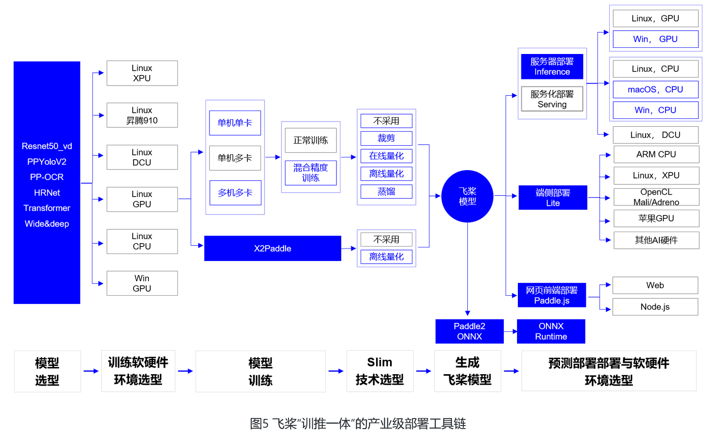
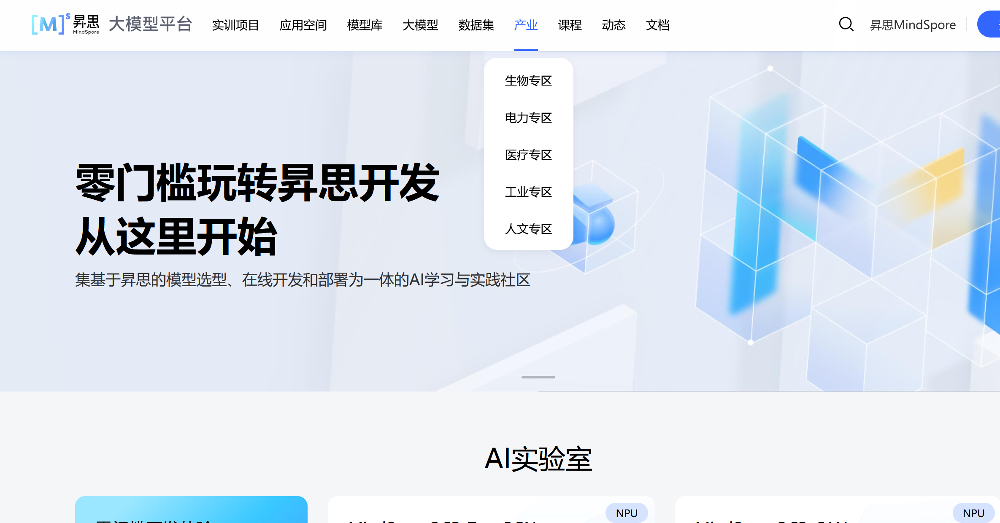

# 3_1_DL框架简介

**作者**: ZhouLong 
**创建日期**: 2026 年 02 月 07 日 
**版本**: 1.0 

    <a href="../02_深度学习介绍/2_1_深度学习简介.html" style="text-decoration: none; color: #0366d6; padding: 8px 15px; border: 1px solid #e1e4e8; border-radius: 5px;">👈 上一页</a>
    <a href="../index.html" style="text-decoration: none; color: #0366d6; padding: 8px 15px; border: 1px solid #e1e4e8; border-radius: 5px;">🏠 首页</a>
    <a href="./3_2_PyTorch简介.html" style="text-decoration: none; color: #0366d6; padding: 8px 15px; border: 1px solid #e1e4e8; border-radius: 5px;">下一页 👉</a>

## **深度学习框架有哪些**

当前（2026年2月），市面上常见的主流的深度学习框架有： 
- 国外——TensorFlow，PyTorch，Keras
- 国内——PaddlePaddle，MindSpore

<b>建议</b>

建议大家先掌握好PyTorch、TensorFlow等，再掌握国内的一些框架。国内的框架目前生态仍待完善，使用有时候遇到问题不好解决。但国产框架在很多生产场景都有应用，后续可根据需求学习了解

下面是对这几种框架的详细介绍和对比：

### 1.1 PyTorch

<a href="https://docs.pytorch.org/docs/stable/index.html" target="_blank" ><b>PyTorch官网</b></a>

PyTorch 是 2016 年由 Facebook 人工智能研究院开发的开源深度学习框架。它发展历经 0.x、1.x、2.x 系列，不断提升性能与功能。它是目前市场上最流行的深度学习框架之一。它基于Python语言，提供了强大的GPU加速功能和动态计算图的支持。PyTorch的应用范围非常广泛，包括图像和语音识别、自然语言处理、计算机视觉、推荐系统等领域。PyTorch具有易于使用、灵活性高和代码可读性好等特点，使得它成为深度学习研究和应用的首选框架之一。

PyTorch的发展历程映射了整个深度学习框架的演进趋势。其前身Torch框架基于Lua语言，虽然提供了模块化网络、自动求导等特性，但由于Lua语言生态狭小，在Python横行的科研圈中缺乏吸引力。2016年，Facebook AI Research团队决定重写Torch框架，保留其计算图设计与模块系统，同时切换到Python平台，从而诞生了PyTorch的第一个公开版本。

2017 年：PyTorch 开源后迅速迭代，支持动态计算图（Define-by-Run），成为研究领域的首选工具。

2018 年：发布 PyTorch 1.0，整合了 Caffe2（Facebook 的另一个深度学习框架）的生产级功能，并引入 TorchScript，支持模型导出和部署。

2020 年：推出 TorchServe，简化模型部署流程，进一步向工业应用渗透。

2022 年：发布 PyTorch 2.0，引入编译优化技术（如 torch.compile），显著提升训练和推理性能。

**PyTorch 的核心价值与作用**

1. 科研与创新的催化剂

    动态计算图：允许研究者实时修改网络结构，尤其适合探索性任务（如新型神经网络架构、强化学习）。

    易用性：与 Python 生态无缝集成，大大降低学习门槛，同时语法相对非常简洁。

    社区驱动：开源社区贡献了大量前沿模型，加速了技术迭代。

2. 工业应用的桥梁

    生产部署工具链：通过 TorchScript、ONNX 导出模型，支持跨平台部署（移动端、服务器、边缘设备）。

    企业级支持：Meta、特斯拉、OpenAI 等公司广泛使用 PyTorch 开发产品（如自动驾驶、ChatGPT）。

### 1.2 TensorFlow

<a href="https://www.tensorflow.org/?hl=zh-cn" target="_blank" ><b>TensorFlow官网</b></a>

TensorFlow是一个由Google Brain团队开发的开源深度学习框架，是非常受欢迎和广泛使用的框架。使用数据流图来表示计算图，其中节点表示数学操作，边表示数据流动。使用TensorFlow可以利用GPU和分布式计算来加速训练过程。该框架有着广泛的应用场景，包括图像识别、自然语言处理、语音识别、推荐系统等。同时，TensorFlow也有着丰富的社区支持和文档资源，使其容易学习和使用。

Tensorflow有三种计算图的构建方式：静态计算图，动态计算图，以及Autograph。 
　　TensorFlow1.0时代，采用的是静态计算图，需要先使用TensorFlow的各种算子创建计算图，再开启一个会话Session，显示执行计算图。 
　　TensorFlow2.0时代，采用的是动态计算图，即每使用一个算子后，该算子会被动态加入到隐含的默认计算图中立即执行得到结果，而无需开启Session。 
TensorFlow2 默认使用动态计算图（Eager Excution）。使用动态计算图的好处是方便调试程序，但缺点是运行效率相对会低一些。

**TensorFlow的特点**

可移植、跨平台性强：相同的代码和模型可以同时在服务器、PC、移动设备上运行。

良好的社区生态：TensorFlow 的官方文档几乎为所有的函数与所有的参数都进行了详细的阐述。并且很大一部分的官方教程支持中文，对于国内学习成本较低。

内置算法非常完善：在 TensorFLow 之中内嵌了我们在机器学习中能用到的绝大部分的算法。

适用工业生产：TensorFlow 内置的 Service、分布式等结构能够帮助个人和企业很方便完成模型的训练与部署。

编程扩展性好：支持市面上大多数编程语言比如：Python、C、R、Go等。

**TensorFLow的缺点**

TensorFlow程序的调试比较麻烦，不能深入其内部进行调试。

TensorFlow中的许多高阶 API 导致我们修改我们自己的模型有一定难度。

TensorFlow1.x 版本与 TensorFlow2.x 的差别较大，代码版本迁移比较麻烦。

### 1.3 Keras

<a href="https://keras.io/" target="_blank" ><b>Keras官网</b></a>

Keras最初由François Chollet开发，现在为TensorFlow官方API。Keras 是一个用 Python 编写的高级深度学习 API，以其简洁、灵活和强大的特性著称，能够运行在 JAX、TensorFlow 或 PyTorch 等底层框架之上。它旨在降低开发者的认知负荷，同时通过清晰的路径支持从简单到任意复杂的工作流，被 NASA、YouTube 和 Waymo 等组织广泛使用。

**Keras 的主要特点**

用户友好：Keras 提供了一个一致且简洁的API，减少了常见用例所需的代码量，同时提供清晰且有用的错误消息。

模块化和可组合：模型可以理解为由可配置构建块（如层、损失函数、优化器等）组成的有向无环图，这些构建块可以任意连接，只要数据形状匹配即可。

易于扩展：你很容易编写新的层、损失函数和开发复杂的模型，比如多输入/输出模型、共享层模型或非序列模型。

与Python兼容：Keras 没有单独的模型配置格式，所有的模型都是纯 Python 构建的，这使得它可以利用 Python 工具进行调试和检查。

### 1.4 PaddlePaddle

<a href="http://paddlepaddle.org/" target="_blank" ><b>PP官网</b></a>

PaddlePaddle（PP）,又称为 飞桨 。飞桨是由百度开发并开源的深度学习框架，以其高性能、易用性和灵活性而受到广泛关注。它支持多平台部署，包括Linux、Windows、Mac，并能够在CPU、GPU 以及多机多卡环境下运行。其框架较多用于生产环境。在使用语法上和PyTorch相似。

    

**PaddlePaddle 的主要特性**

高效并行计算： 提供对多机多卡的原生支持，提升分布式训练性能。

端到端部署： 一站式解决方案，从数据预处理、训练到模型部署全流程支持。

预训练模型丰富： 提供了多种官方预训练模型（如BERT、ResNet、ERNIE等）。

支持动态图与静态图： 类似 PyTorch 的动态图机制，也支持静态图优化。

高性能推理： Paddle Inference、Paddle Lite 等工具支持高性能模型部署到服务器端和移动端。

中文文档支持好

### 1.5 MindSpore

<a href="https://www.mindspore.cn/" target="_blank" ><b>MindSpore官网</b></a>

MindSpore是 华为 推出的面向AI研究人员和开发者的深度学习框架，提供了高效、灵活、易用的平台特性。它支持NPU（Ascend，华为自研的AI计算处理器）、GPU、CPU等多种硬件。MindSpore架构上支持端、边、云全场景的AI计算服务，易于开发、高性能、轻量级、适应性强。 在使用语法上和PyTorch相似。

    

1. **优点**

统一架构：支持端、边、云多种硬件平台（如Ascend、GPU、CPU），一套代码可跨平台部署。

动态/静态图统一：提供“动静合一”的编程体验，兼顾开发灵活性与部署高性能。

计算优化：针对昇腾（Ascend）芯片深度优化，实现高性能计算和低功耗。

类PyTorch API：接口设计贴近PyTorch，降低学习成本，支持Python原生控制流。

2. **未来**

AI框架的发展离不开完善的生态支撑，目前国产的框架生态成熟度较低。MindSpore后续还在不断完善。为了推广框架，其参与了较多行业垂直场景的应用，如生物、电力、医疗、工业、人文专区。目前这些领域产出了一些模型、数据和应用。

<b>建议</b>

目前国内的各个厂家都在推各自的框架和生态，举办较多活动和比赛，有丰厚奖金，同时还开设很多课程。这些框架在产业运用较多，大家可以根据兴趣学习。

    <a href="../02_深度学习介绍/2_1_深度学习简介.html" style="text-decoration: none; color: #0366d6; padding: 8px 15px; border: 1px solid #e1e4e8; border-radius: 5px;">👈 上一页</a>
    <a href="../index.html" style="text-decoration: none; color: #0366d6; padding: 8px 15px; border: 1px solid #e1e4e8; border-radius: 5px;">🏠 首页</a>
    <a href="./3_2_PyTorch简介.html" style="text-decoration: none; color: #0366d6; padding: 8px 15px; border: 1px solid #e1e4e8; border-radius: 5px;">下一页 👉</a>

