# 3_2_PyTorch配置

**作者**: ZhouLong<br>
**创建日期**: 2026 年 02 月 07 日<br>
**版本**: 1.0<br>

<div style="display: flex; justify-content: space-between; padding: 15px 0; margin: 20px 0; border-top: 1px solid #eaeaea; border-bottom: 1px solid #eaeaea;">
    <a href="./3_1_DL框架简介.html" style="text-decoration: none; color: #0366d6; padding: 8px 15px; border: 1px solid #e1e4e8; border-radius: 5px;">👈 上一页</a>
    <a href="../index.html" style="text-decoration: none; color: #0366d6; padding: 8px 15px; border: 1px solid #e1e4e8; border-radius: 5px;">🏠 首页</a>
    <a href="./3_3_快速开始.html" style="text-decoration: none; color: #0366d6; padding: 8px 15px; border: 1px solid #e1e4e8; border-radius: 5px;">下一页 👉</a>
</div>

## 1 PyTorch的技术链路

下图展示了从硬件层到应用层的英伟达 GPU 与 PyTorch AI 框架之间的完整技术栈结构。目前大多数的AI训练都是基于此技术链路。

<div style="margin: 20px 0; text-align: center;">
    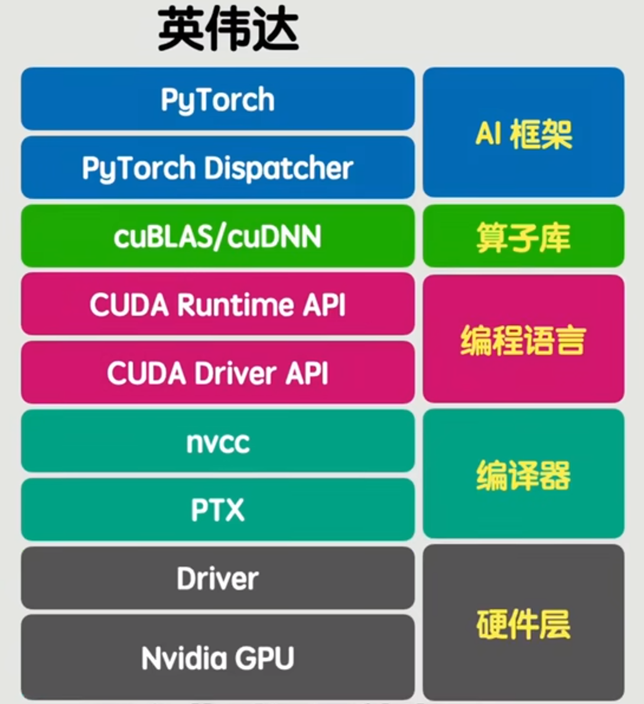
</div>

1. **硬件层**
- **Nvidia GPU**：整个体系的物理基础，提供并行计算能力，支持深度学习训练与推理。

2. **驱动层**
- **Driver**：包含 **CUDA Driver API**，负责操作系统与 GPU 之间的通信，管理 GPU 资源，如内存分配、上下文管理、内核启动等。

3. **编译与中间表示层**
- **nvcc**：NVIDIA CUDA 编译器，将 CUDA C/C++ 代码编译为 GPU 可执行的代码。
- **PTX**（Parallel Thread Execution）：一种中间汇编语言，实现跨 GPU 架构的兼容性，可在不同代 GPU 上运行。

4. **运行时与编程接口层**
- **CUDARuntimeAPI**：提供更高层次的编程接口，简化 CUDA 程序开发，如内存管理、核函数调用等。

5. **算子库与计算加速层**
- **cuBLAS/cuDNN**：NVIDIA 提供的 GPU 加速库，分别用于基础线性代数运算和深度神经网络计算，是深度学习训练的核心加速组件。
- **算子库**：泛指各类针对特定计算任务优化的 GPU 算子集合，通常由 cuBLAS、cuDNN、cuFFT 等组成。

6. **AI 框架调度层**
- **PyTorchDispatcher**：PyTorch 中的动态分发机制，根据输入张量类型、设备等自动选择最优的计算后端（如 CPU、CUDA、XLA 等）。

7. **AI 框架层**
- **PyTorch**：最终和用户交互的API，也就是我们平时使用的工具，提供动态图机制、自动微分、模块化网络构建等功能，广泛应用于研究与生产。


## 2 安装方法

安装分为cpu和gpu安装版本，一般简单测试可以只是用cpu，如果训练还是得采取gpu运算的版本。cpu版本安装较简单，gpu则稍微复杂，但是配置一次，就可以一直使用。

注意安装PyTorch前要配置好vscode和conda环境，可以参考 <a href="../01_Python介绍/1_2_IDE和环境管理工具安装.html">IDE和环境管理工具安装</a>

在安装PyTorch之前，同时需要判断你的计算机是否安装了NVIDIA显卡，因为PyTorch的GPU版本需要NVIDIA显卡来加速计算。需要通过以下步骤来判断。<br>
1. 打开设备管理器：在Windows上，按下Win键和X键，然后选择“设备管理器”。在macOS上，打开“系统偏好设置”，选择“硬件”选项卡，然后点击“设备管理器”。<br>
2. 查看显示适配器：在设备管理器中，展开“显示适配器”或“图形处理器”部分，查看是否有NVIDIA显卡的列表。如果有NVIDIA显卡，那么你的计算机适合安装PyTorch的GPU版本。

下图代表无gpu
<div style="margin: 20px 0; text-align: center;">
    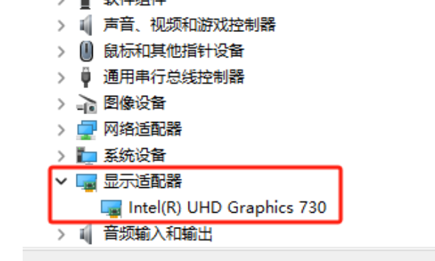
</div>
下图代表有gpu
<div style="margin: 20px 0; text-align: center;">
    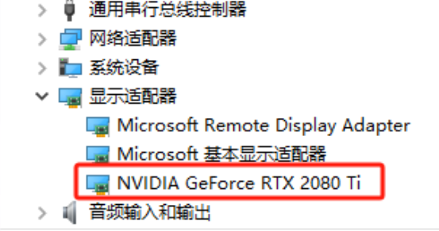
</div>
如果没有NVIDIA显卡，只可以安装PyTorch的CPU版本。如果有NVIDIA显卡，则可安装GPU版本。流程看下述内容。

### 2.1 cpu版本

首先创建虚拟环境并激活，`envname`是虚拟环境的名字，可以任意取，python版本可以任意选择，这里选择了`3.11`。
```
# 创建新环境
conda create -n envname python=3.11

# 激活环境
conda activate envname
```

接着使用pip进行安装
```
pip install torch torchvision
```

检测是否安装上了
```
pip show torch
```
如果出现了版本信息，则代表安装成功！
```
Name: torch
Version: 2.10.0
Summary: Tensors and Dynamic neural networks in Python with strong GPU acceleration
Home-page: https://pytorch.org
Author:
Author-email: PyTorch Team <packages@pytorch.org>
License: BSD-3-Clause
............
```

### 2.2 gpu版本

gpu版本的安装较为复杂，我们需要额外先安装好技术链中的Cuda和CuDNN工具，再安装特定版本的gpu版本的PyTorch。

1. 首先查看CUDA显卡驱动版本

在终端输入`nvidia-smi`，可以查看到版本为12.3。

<div style="margin: 20px 0; text-align: center;">
    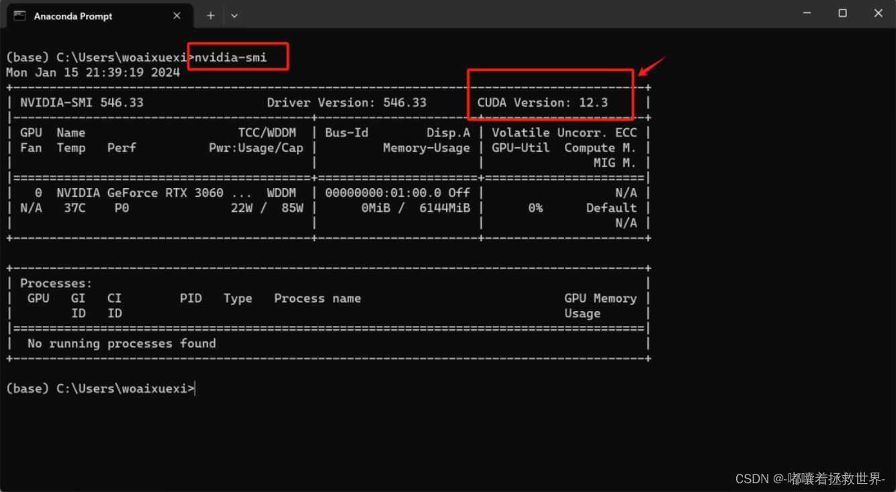
</div>

2. 在官网下载cuda

从官网下载对应的CUDA版本，由于本机器的显卡版本为12.3，只需要安装小于或者等于12.3都是可以的，因此这里选择安装12.0。点击链接进入
<a href="https://developer.nvidia.com/cuda-toolkit-archive">官网</a>

<div style="margin: 20px 0; text-align: center;">
    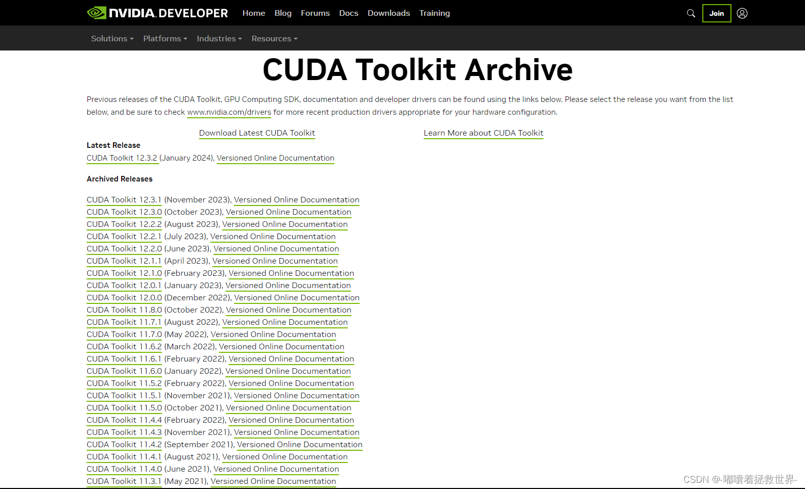
</div>

<div style="margin: 20px 0; text-align: center;">
    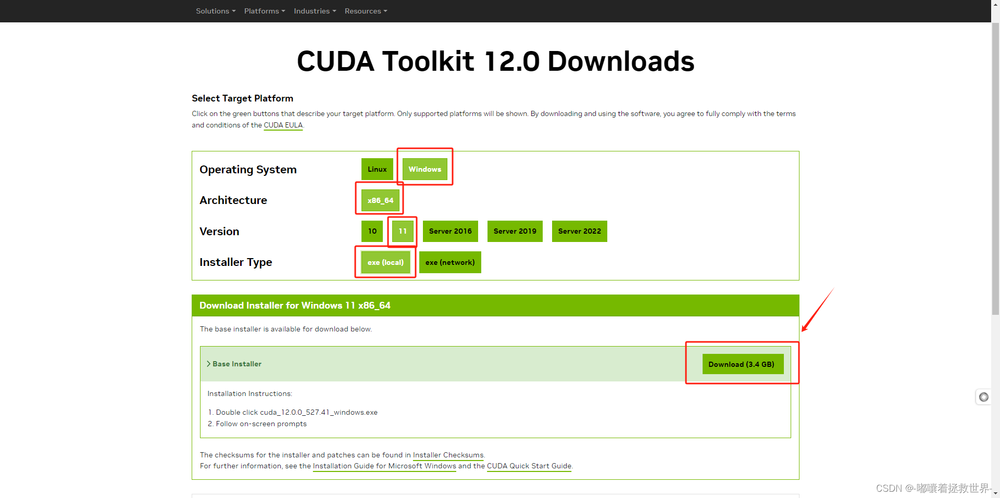
</div>

后续安装都选择默认即可安装。

3. 设置环境变量

安装完CUDA后，我们需要设置一下环境变量：<br>
右键点击【此电脑】→【属性】→【高级系统设置】→【环境变量】<br>
在【系统变量】中找到Path，点击【编辑】<br>
点击【新建】，添加以下路径：<br>
```
    C:\Program Files\NVIDIA GPU Computing Toolkit\CUDA
    C:\Program Files\NVIDIA GPU Computing Toolkit\CUDA\v11.8\bin
    C:\Program Files\NVIDIA GPU Computing Toolkit\CUDA\v11.8\libnvvp
    C:\Program Files\NVIDIA GPU Computing Toolkit\CUDA\v11.8\x64
```

3. 测试cuda安装是否成功

在终端输入`nvcc  -V`，如果输出了版本信息则代表成功！

<div style="margin: 20px 0; text-align: center;">
    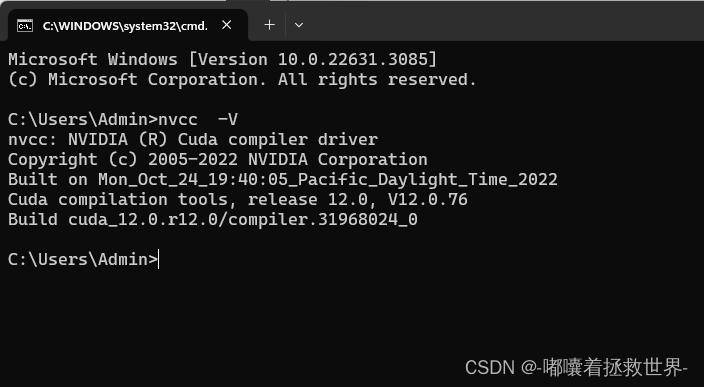
</div>

4. 官网安装CuDNN

点击链接进入<a href="https://developer.nvidia.com/cudnn">官网</a><b>注意：需要注册登录才能进行安装！</b>

<div style="margin: 20px 0; text-align: center;">
    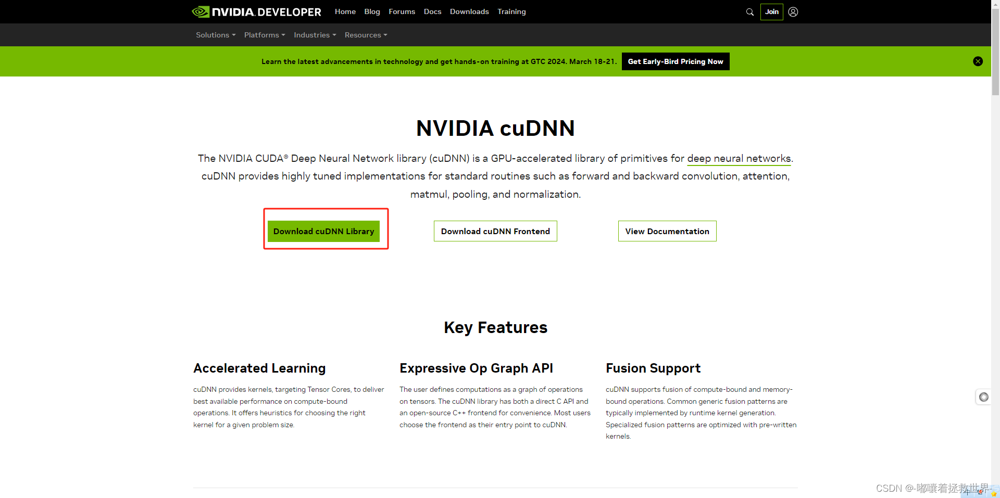
</div>
选择12.x的即可，然后根据自己的电脑配置选择对应的版本。不是最新的就是最好的！
<div style="margin: 20px 0; text-align: center;">
    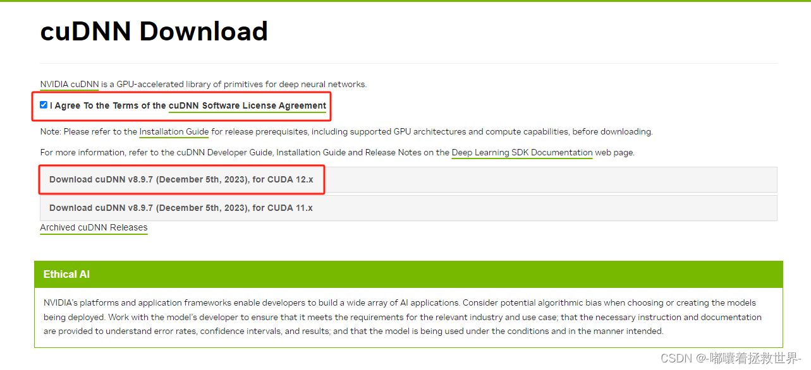
</div>
安装并解压完后，将这几个文件夹复制到CUDA安装路径下，就已经安装完成。<br>
如复制到`.../NVIDIA GPU Computing Toolkit/CUDA/v11.6`下
<div style="margin: 20px 0; text-align: center;">
    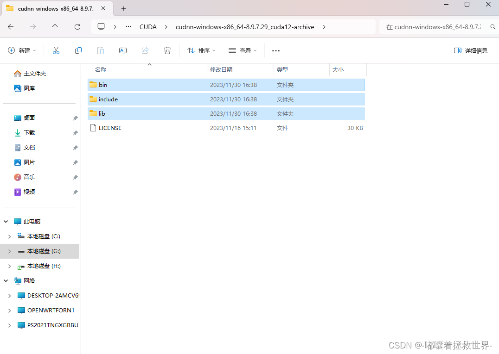
</div>
复制完成
<div style="margin: 20px 0; text-align: center;">
    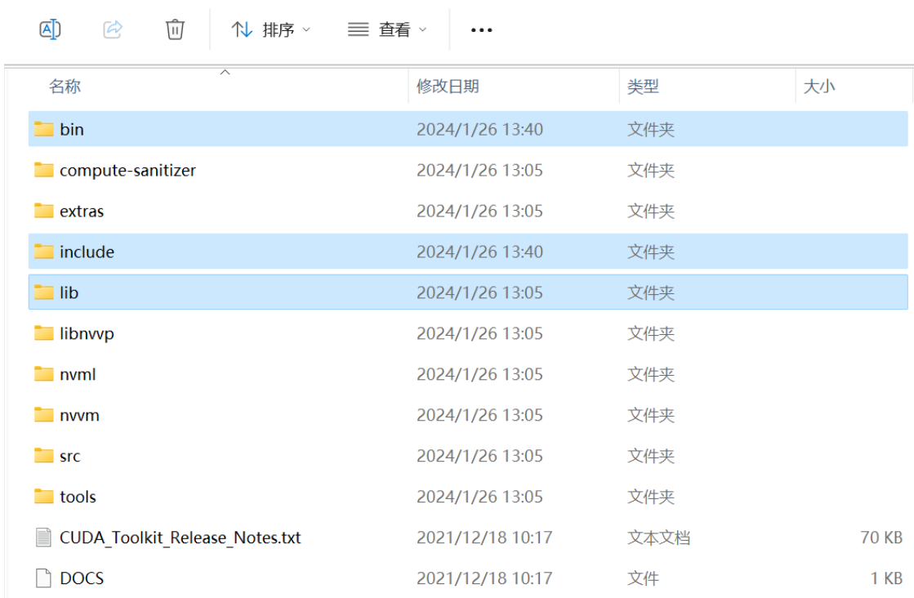
</div>

5. 进入PyTorch官网

点击链接进入<a href="https://pytorch.org/get-started/locally/">官网</a>，选择合适的版本后，复制下载命令。
<div style="margin: 20px 0; text-align: center;">
    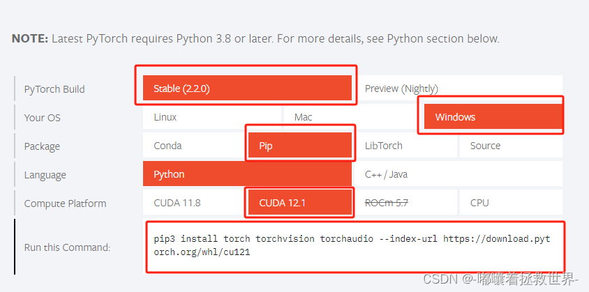
</div>

6. 在虚拟环境中下载

首先创建虚拟环境并激活，`envname`是虚拟环境的名字，可以任意取，python版本可以任意选择，这里选择了`3.11`。
```
# 创建新环境
conda create -n envname python=3.11

# 激活环境
conda activate envname
```

接着使用pip进行安装<b>（注意这里不要直接复制命令，要选择合适的版本来安装!）</b>
```
pip3 install torch torchvision torchaudio --index-url https://download.pytorch.org/whl/cu121
```

检测是否安装上了
```
pip show torch
```
如果出现了版本信息，则代表安装成功！


**引用**

1、<a href="https://blog.csdn.net/little_carter/article/details/135934842?ops_request_misc=elastic_search_misc&request_id=948f9875adf23f8e20aed3380e384c31&biz_id=0&utm_medium=distribute.pc_search_result.none-task-blog-2~all~top_positive~default-1-135934842-null-null.142^v102^pc_search_result_base7&utm_term=pytorch%E5%AE%89%E8%A3%85&spm=1018.2226.3001.4187">2024最新Pytorch安装教程</a><br>

<div style="display: flex; justify-content: space-between; padding: 15px 0; margin: 20px 0; border-top: 1px solid #eaeaea; border-bottom: 1px solid #eaeaea;">
    <a href="./3_1_DL框架简介.html" style="text-decoration: none; color: #0366d6; padding: 8px 15px; border: 1px solid #e1e4e8; border-radius: 5px;">👈 上一页</a>
    <a href="../index.html" style="text-decoration: none; color: #0366d6; padding: 8px 15px; border: 1px solid #e1e4e8; border-radius: 5px;">🏠 首页</a>
    <a href="./3_3_快速开始.html" style="text-decoration: none; color: #0366d6; padding: 8px 15px; border: 1px solid #e1e4e8; border-radius: 5px;">下一页 👉</a>
</div>


